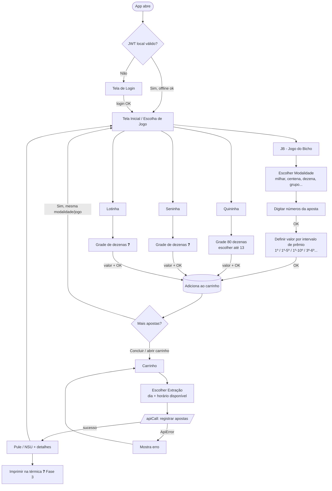

# Fluxo do App — App Zooloo

> Mapa de navegação do PDV móvel, do login até a impressão do pule. O conceito
> central é o **carrinho**: o vendedor monta várias apostas, elas se acumulam no
> carrinho, e só no final escolhe a **extração** (dia/horário) e finaliza.
> Detalhes de regra que dependem do banco estão marcados com ❓ (ver [[fase-0-regras]]).

## Regra de ouro (vale para todo o fluxo)

Em **toda** tela com valores, o app só **monta dados brutos** e **relê** o que o
backend devolve. O app nunca calcula prêmio, comissão, limite ou ganhador.
Ver [[docs/CLAUDE#Regra-de-ouro-inegociável]] e [[docs/plano#2.4]].

---

## Conceito central: o carrinho

Diferente de um fluxo linear "uma aposta por vez", o app funciona como um **carrinho
de compras**:

1. O vendedor escolhe um jogo, monta uma aposta e **adiciona ao carrinho**.
2. A tela volta para que ele possa adicionar **outra aposta** (do mesmo jogo ou de outro).
3. Quando termina, abre o **carrinho**, escolhe a **extração** (dia/horário) e **finaliza**.
4. Ao finalizar, o backend registra tudo e o app imprime o **pule** (com NSU e detalhes).

✔️ **Confirmado:** A extração é selecionada globalmente na tela de Preview para todas as apostas do carrinho. No entanto, o vendedor pode selecionar **múltiplas extrações** (se `cfg_parametros.multiplas_extracoes` permitir), e o app gera a combinação de jogos multiplicando-os para cada extração no payload final.

---

## Diagrama de navegação

---

## Fluxo passo a passo

### 0. Abertura do app

`AuthContext.checkAuthStatus` roda no mount e decodifica o **JWT local** (sem rede).
Se `exp` está no futuro, abre direto na tela inicial — mesmo offline (maquinetas POS).
Senão, vai para o login. Ver [[docs/README-AUTH#Por-que-o-app-abre-offline]].

### 1. Login

Tela `app/login.tsx`. Vendedor informa login/senha → `AuthService.login` → backend
devolve `access`, `refresh`, `user`, `vendedor`, `permissoes`. Tokens no SecureStore;
o guard (`app/_layout.tsx`) redireciona para a área autenticada. Ver [[docs/README-AUTH]].

### 2. Tela inicial — escolha do tipo de jogo

O vendedor escolhe entre:

- **JB** — Jogo do Bicho
- **Quininha**
- **Seninha**
- **Lotinha**

❓ _A confirmar:_ lista fixa ou filtrada pelas `permissoes` do vendedor (já retornadas no login)?

---

### 3. Fluxo do JB (Jogo do Bicho)

O mais elaborado. Etapas:

**3.1 — Escolher modalidade.** Milhar, centena, dezena, grupo, etc.
✔️ **Confirmado:** O MVP da Fase 2 foca na modalidade **MILHAR** (4 dígitos). As demais modalidades ficam ocultadas/desativadas até as próximas fases.

**3.2 — Digitar os números da aposta.** Abre uma tela de digitação onde o vendedor
informa os números conforme a modalidade (ex.: 4 dígitos para milhar, 2 para dezena).
Ao clicar em **OK**, segue para o valor.
✔️ **Confirmado:** A modalidade Milhar exige palpites de 4 dígitos. A listagem de palpites vira o campo `palpites` que é enviado como array e processado como string separada por vírgula no helper.

**3.3 — Definir o valor por intervalo de prêmio.** Esta é a parte rica do JB. O vendedor
informa o valor associado a um **intervalo de colocações de prêmio**, sempre dentro da
faixa **1º ao 10º**. Exemplos:

- **1º prêmio** → informa o valor
- **1º ao 5º prêmio** → informa o valor
- **1º ao 10º prêmio** → informa o valor
- **Intervalo livre** → ex.: 3º ao 5º, 1º ao 6º, 4º ao 9º — qualquer intervalo dentro de 1–10

Regras de validação:

- ✔️ **Intervalo Contíguo:** A API espera `colocacao_inicial` e `colocacao_final` (intervalo de 1 a 10). Se o vendedor selecionar colocações não contíguas no app, a UI preenche as lacunas automaticamente para garantir a contiguidade no payload final.
- ✔️ **Valor da Aposta:** Controlado pelo switch `bitT_rateado` ("Por Cada" vs "Rateado"). Se "Por Cada", o total do item é multiplicado pela quantidade de prêmios no intervalo. Se "Rateado", o total do item é exatamente o valor digitado.
- ✔️ **Múltiplos Intervalos:** Um item no carrinho só suporta um único intervalo (início ao fim), mas o vendedor pode adicionar múltiplas apostas ao carrinho (ex: uma para o 1º prêmio e outra para o 5º prêmio).

Ao clicar em **OK**, a aposta vai para o **carrinho** e a tela **volta para a tela de
modalidades**, para o vendedor montar outra aposta do JB se quiser. Se não quiser, ele
clica em **Concluir** ou no **carrinho** para finalizar.

---

### 4. Fluxo da Quininha

**4.1 — Grade de dezenas.** Abre uma grade com **80 dezenas**, onde o vendedor escolhe
**até 13 números**.
❓ _Confirmar a quantidade mínima de números (1? 5?) e se há faixas com valores diferentes._

**4.2 — Valor.** Informa o valor e clica em **OK**.

**4.3 — Carrinho.** A aposta vai para o carrinho. O vendedor pode adicionar mais apostas
ou ir ao carrinho escolher a extração e encerrar.

---

### 5. Fluxo da Seninha e da Lotinha

Seguem o **mesmo fluxo da Quininha**: grade de dezenas → escolher números → valor → OK →
carrinho.

❓ _A confirmar para cada uma (ver `lotinha_quininha_senhinha.sql` + `regraJogos.md`):_

- Quantas dezenas tem a grade? (Quininha = 80; Seninha = ❓; Lotinha = ❓)
- Quantos números o vendedor pode escolher? (Quininha = até 13; Seninha = ❓; Lotinha = ❓)
- Mínimo de números por aposta?

---

### 6. Carrinho

Reúne **todas as apostas** adicionadas (de qualquer jogo). O vendedor:

- Revê as apostas e pode **remover** itens (edição deve ser feita removendo e adicionando novamente).
- Escolhe as **extrações** e a **data** na tela de Preview.
- Vê o **valor total estimado** localmente para UX (calculado multiplicando pelo número de extrações se não for rateado).
- **Finaliza** (enviando para o backend, que recalcula oficialmente).

✔️ **Confirmado:** A lista de extrações disponíveis é carregada do backend via `SorteioRestService::abertos` para a data selecionada. O app realiza a multiplicação de cada item do carrinho para cada extração no payload final.

### 7. Finalização e pule

Ao finalizar, o app envia o carrinho via `apiCall` (Bearer + refresh + retry já cuidados
pelo `apiClient`). Em erro, `ApiError` é exibido e o vendedor pode tentar de novo.
Com sucesso, o backend retorna os dados registrados (IDs, **NSU**, valores, extração) e o
app renderiza o **pule** para impressão. Ver [[docs/CLAUDE#Como-falar-com-o-backend]].

### 8. Impressão (Fase 3)

Impressão do pule na **térmica** da maquineta POS. Planejada para a Fase 3
(ver [[docs/plano#12]]). O layout do pule já deve ser pensado para a largura da térmica
(32/48 colunas) desde agora, para evitar retrabalho.

---

## Telas / componentes reaproveitáveis

- **Tela inicial** (escolha de jogo)
- **Grade de dezenas** parametrizável (Quininha 80, Seninha/Lotinha ❓) — mesma base
- **Input de valor** (máscara R$ + validação)
- **Carrinho** (comum a todos os jogos)
- **Seletor de extração** (no carrinho)
- **Pule / comprovante**

O que muda por jogo é a etapa de **montar a aposta**: o JB tem modalidade + dígitos +
intervalo de prêmios; os demais têm grade de dezenas + valor.

---

## Estado a manter no app (carrinho)

O carrinho precisa de um estado global (ex.: Context próprio, separado do `AuthContext`)
contendo a lista de apostas em construção. Cada item do carrinho deve guardar, no mínimo:

- `jogo` (JB / Quininha / Seninha / Lotinha)
- `modalidade` (só JB)
- `palpites` / números escolhidos (formato bruto ❓ Fase 0)
- para JB: `intervalo` (início, fim) + `valor`
- para os demais: `valor`

A **extração** é definida uma vez no carrinho, na finalização. Nenhum cálculo de prêmio
ou total fica no app — o total exibido vem do backend.

---

## Pendências do fluxo

- ✔️ **Extração:** Selecionada na Preview, compartilhada pelas apostas do carrinho. Lista vem do backend via `SorteioRestService::abertos` para a data informada.
- ✔️ **JB Modalidades MVP:** Apenas **MILHAR** ativo, exigindo 4 dígitos.
- ✔️ **JB Prêmios:** Intervalo contíguo via `colocacao_inicial` e `colocacao_final`. Switch "Por Cada" vs "Rateado" controla a multiplicação.
- ❓ Quininha — mínimo de números (máx confirmado = 13 de 80) — *Fase Futura*
- ❓ Seninha / Lotinha — tamanho da grade e quantidade de números escolhíveis — *Fase Futura*
- ✔️ **Carrinho:** Permite remover itens. Não possui edição direta (deve remover e reinserir).
- ❓ Lista de jogos: fixa ou filtrada por `permissoes`? (MVP: fixo com JB ativo)
- ✔️ **Formato do `palpites`:** Para o Milhar, palpites são enviados como array no JSON e processados no backend.

## Referências

- [[docs/CLAUDE]] — índice operacional do app
- [[docs/plano]] — roadmap e modelagem do banco
- [[docs/README-AUTH]] — autenticação e abertura offline
- [[docs/regras-negocio]] — regras das modalidades
- [[fase-0-regras]] — regras + amostras do banco (bloqueante)
- [[fase-2-aposta-bicho]] — implementação do fluxo do JB
- [[tasks/roadmap]] — quadro Kanban
