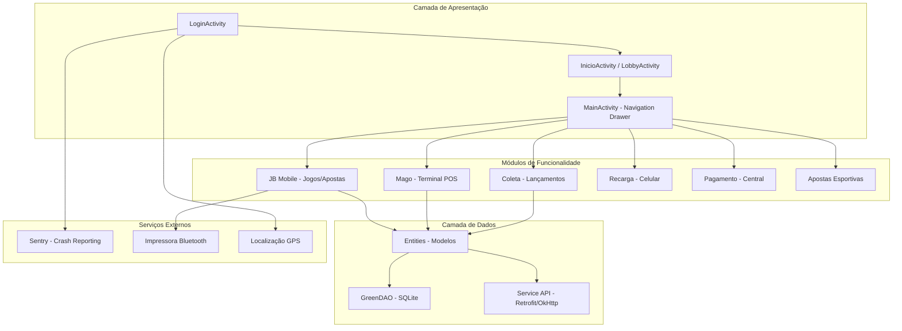
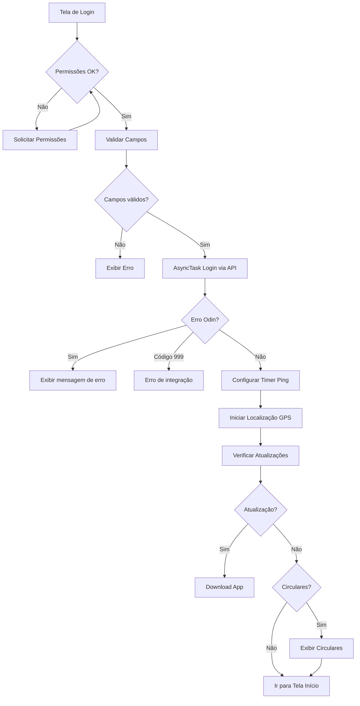
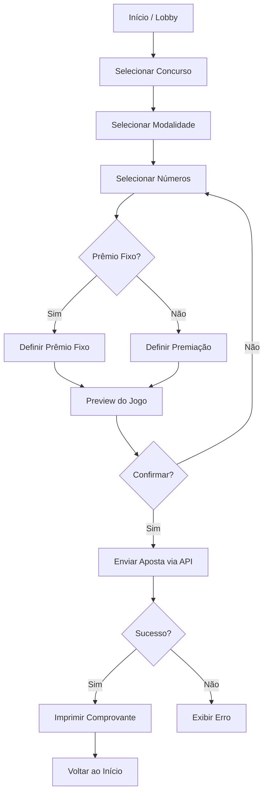
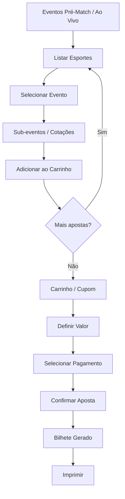
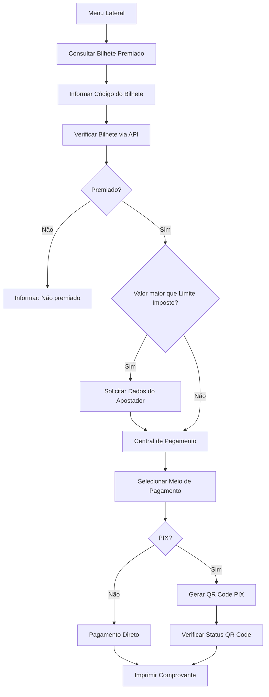
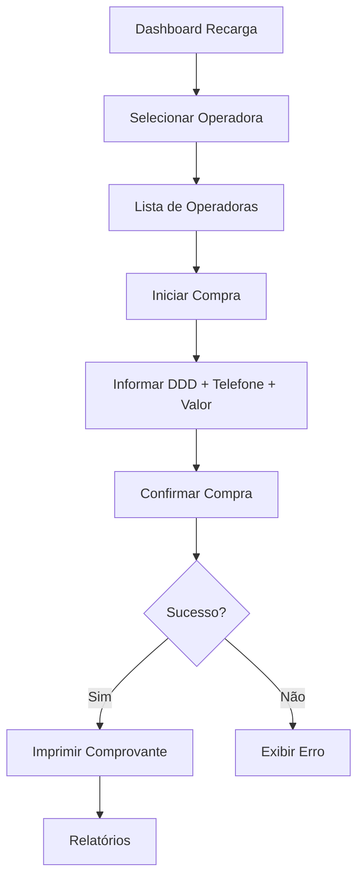
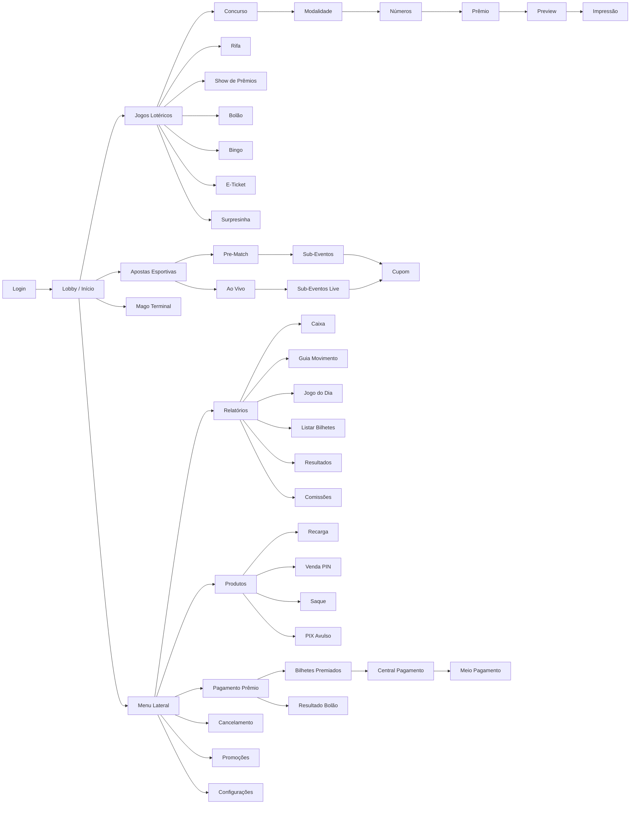

# Documentação do App Base — Cambista Mobile (SportingPlay)

> [!NOTE]
> Documentação gerada a partir da engenharia reversa do APK decompilado em `C:\desenvolvimento\app-base`.
> O código-fonte está ofuscado (JADX), portanto nomes de variáveis e classes auxiliares podem não refletir os originais.

---

## 1. Visão Geral

| Propriedade | Valor |
|---|---|
| **Package** | `cambista.sportingplay.info.cambistamobile` |
| **Versão** | `8.13.002.0-azul` (versionCode 73) |
| **Nome do App** | LE (Loteria Esportiva) |
| **Min SDK** | 21 (Android 5.0 Lollipop) |
| **Target SDK** | 28 (Android 9 Pie) |
| **Flavor/Variante** | `azul` |
| **Application Class** | [SportingApplication.java](file:///c:/desenvolvimento/app-base/sources/cambista/sportingplay/info/cambistamobile/SportingApplication.java) |

O aplicativo é uma plataforma mobile para **cambistas** (operadores de apostas lotéricas), permitindo registrar apostas, gerenciar bilhetes, processar pagamentos, imprimir comprovantes e gerar relatórios operacionais. Ele opera como terminal de ponto de venda (POS) móvel.

---

## 2. Arquitetura Geral



---

## 3. Estrutura de Pacotes

### 3.1 Pacote Principal
```
cambista.sportingplay.info.cambistamobile/
├── SportingApplication.java          # Application class (singleton)
├── R.java                            # Recursos compilados
├── activity/                         # Activities principais
│   ├── login/                        # Tela de login
│   ├── bilhete/                      # Gestão de bilhetes
│   ├── bolaoevento/                  # Bolão por evento
│   ├── bolaolistar/                  # Listagem de bolões
│   ├── circular/                     # Circulares/avisos
│   ├── cupom/                        # Cupom de aposta
│   ├── downloadapp/                  # Atualização do app
│   ├── prematcheventosfull/          # Eventos pré-match
│   ├── prematcherAoVivo/             # Eventos ao vivo
│   ├── subevento/                    # Sub-eventos pré-match
│   ├── subeventoaovivo/              # Sub-eventos ao vivo
│   ├── surpresinha/                  # Aposta surpresa
│   └── menu_lateral/                 # Menu lateral (navigation drawer)
│       ├── cancelamento/             # Cancelamento de bilhetes
│       ├── pagamento_premio/         # Pagamento de prêmios
│       ├── produtos/                 # Venda PIN, PIX, Saque
│       ├── promocoes/                # Promoções
│       ├── relatorios/               # Relatórios operacionais
│       └── usuario/                  # Troca de senha
├── entities/                         # Modelos de dados
│   ├── auth/                         # Autenticação
│   ├── atualizacao/                  # Atualização do app
│   ├── bolao/                        # Bolão
│   ├── configuracao/                 # Configurações
│   ├── eventos/                      # Eventos esportivos
│   ├── impressao/                    # Impressão
│   ├── metodoPagamento/              # Métodos de pagamento
│   ├── payments/                     # Pagamentos
│   ├── pin/                          # PIN
│   ├── promocoes/                    # Promoções
│   ├── relatorio/                    # Relatórios
│   └── venda/                        # Venda/Carrinho
├── util/                             # Componentes UI customizados
└── w/                                # Módulos de negócio
    ├── jbmobile/                     # Módulo JB Mobile (loteria)
    ├── mago/                         # Módulo Mago (terminal POS)
    ├── coleta/                       # Módulo Coleta
    ├── pagamento/                    # Módulo Pagamento
    └── recarga/                      # Módulo Recarga celular
```

---

## 4. Módulos Detalhados

### 4.1 Módulo Login e Autenticação

| Componente | Arquivo |
|---|---|
| Activity principal | [LoginActivity.java](file:///c:/desenvolvimento/app-base/sources/cambista/sportingplay/info/cambistamobile/activity/login/LoginActivity.java) |
| Entidade Auth | [AuthOdin.java](file:///c:/desenvolvimento/app-base/sources/cambista/sportingplay/info/cambistamobile/entities/auth/AuthOdin.java) |
| Addon Sporting | [AddonSporting.java](file:///c:/desenvolvimento/app-base/sources/cambista/sportingplay/info/cambistamobile/entities/auth/AddonSporting.java) |

**Funcionalidades:**
- Login com usuário (código numérico de 8 dígitos) e senha (4 dígitos)
- Configuração de terminal (localidade, contexto inicial)
- Verificação de permissões do dispositivo
- Teste de ping para verificar conectividade com o servidor
- Chave de segurança para acesso administrativo
- Verificação de atualizações do app
- Exibição de circulares pós-login
- Timer periódico para verificação de conexão

**Fluxo de Login:**


---

### 4.2 Módulo JB Mobile — Jogos e Loteria

Módulo principal para operações de loteria.

#### Activities do JB Mobile

| Activity | Funcionalidade |
|---|---|
| InicioActivity | Tela inicial do módulo |
| LobbyActivity | Lobby principal (launch: singleTask) |
| ConcursoActivity | Seleção de concurso |
| JogoModalidadeActivity | Modalidade do jogo |
| JogoNumeroActivity | Seleção de números |
| JogoPremioActivity | Definição de prêmio |
| JogoPremioFixoActivity | Prêmio fixo |
| JogoPremioFixoMultiploActivity | Prêmio fixo múltiplo |
| JogoValorFixoActivity | Valor fixo |
| JogoCategoriaActivity | "Time Certo" — categorias |
| PreviewJogoActivity | Preview do jogo antes de confirmar |
| PreviewActivity | Preview do concurso |
| RepeticaoActivity | Repetição de apostas |
| ETicketActivity | E-Ticket (pré-ticket digital) |
| BolaoActivity | Bolão |
| ConfiguracaoImpressora | Config. impressora |
| UltimasTransacoesActivity | Últimas transações |
| FechamentoDiaManualActivity | Fechamento manual do dia |
| PropagandaActivity | Propaganda / Banner |
| LogErroActivity | Log de erros |

#### Sub-módulo Rifa

| Activity | Funcionalidade |
|---|---|
| InicioRifaActivity | Início da rifa |
| RifaApostaZeroActivity | Aposta Rifa (tipo 0) |
| RifaApostaUmActivity | Aposta Rifa (tipo 1) |
| RifaApostaDoisActivity | Aposta Rifa (tipo 2) |
| RifaApostaTresActivity | Aposta Rifa (tipo 3) |
| RifaSelecionaDataActivity | Seleção de data |
| RifaPremioActivity | Prêmio da rifa |
| PreviewRifaActivity | Preview antes de confirmar |
| filtroTipoJogoRifaActivity | Filtro por tipo de jogo |

#### Sub-módulo Show de Prêmios

| Activity | Funcionalidade |
|---|---|
| InicioShowPremiosActivity | Início do show de prêmios |
| ShowPremiosApostaZeroActivity | Aposta Show (tipo 0) |
| ShowPremiosApostaUmActivity | Aposta Show (tipo 1) |
| ShowPremiosApostaDoisActivity | Aposta Show (tipo 2) |
| ShowPremiosApostaTresActivity | Aposta Show (tipo 3) |
| ShowPremiosSelecionaDataActivity | Seleção de data |
| ShowPremiosPremioActivity | Premiação |

#### Sub-módulo Bingo

| Activity | Funcionalidade |
|---|---|
| BingoSalaActivity | Seleção de sala de bingo |
| CartelaBingoActivity | Cartela do bingo |

#### Leitores

| Activity | Funcionalidade |
|---|---|
| [QrCodeReaderActivity](file:///c:/desenvolvimento/app-base/sources/cambista/sportingplay/info/cambistamobile/w/jbmobile/activities/QrCodeReaderActivity.java) | Leitor de QR Code |
| [BarcodeCaptureActivity](file:///c:/desenvolvimento/app-base/sources/cambista/sportingplay/info/cambistamobile/w/jbmobile/activities/BarcodeCaptureActivity.java) | Leitor de código de barras |

---

### 4.3 Módulo Mago — Terminal POS Lotérico

Módulo alternativo de terminal de ponto de venda, com funcionalidades similares ao JB Mobile mas com interface própria.

| Activity | Funcionalidade |
|---|---|
| MagoMainActivity | Menu principal Mago |
| MagoModalidadeActivity | Seleção de modalidade |
| MagoExtracaoActivity | Seleção de extração |
| MagoNumeroActivity | Seleção de números |
| MagoPremioActivity | Premiação |
| MagoCarrinhoActivity | Carrinho de apostas |
| MagoRepetirActivity | Repetir aposta |
| MagoSobreActivity | Sobre o módulo |
| ImpressoraActivity | Configuração de impressora |
| CarrinhoActivity (showdepremios) | Carrinho do Show de Prêmios |

---

### 4.4 Módulo Coleta

Módulo para lançamentos financeiros e consultas operacionais.

| Activity | Funcionalidade |
|---|---|
| MenuActivity | Menu de coleta ("Início") |
| SaldoActivity | Consulta de saldo |
| LancamentoActivity | Lançamento individual |
| LancamentoLoteActivity | Lançamento em lote |
| LancamentoBoletimActivity | Lançamento por boletim |
| ReciboActivity | Recibo de lançamento |
| ConsultaPuleActivity | Consulta de pule (bilhete) |
| ConfirmarCancelamentoActivity | Confirmar cancelamento |

---

### 4.5 Módulo Recarga

Módulo para recarga de celular integrado.

| Activity | Funcionalidade |
|---|---|
| [DashBoard.java](file:///c:/desenvolvimento/app-base/sources/cambista/sportingplay/info/cambistamobile/w/recarga/DashBoard.java) | Dashboard principal |
| [Operadoras.java](file:///c:/desenvolvimento/app-base/sources/cambista/sportingplay/info/cambistamobile/w/recarga/Operadoras.java) | Seleção de operadora |
| [ListaOperadoras.java](file:///c:/desenvolvimento/app-base/sources/cambista/sportingplay/info/cambistamobile/w/recarga/ListaOperadoras.java) | Lista de operadoras |
| [InitCompra.java](file:///c:/desenvolvimento/app-base/sources/cambista/sportingplay/info/cambistamobile/w/recarga/InitCompra.java) | Iniciar compra |
| [Compra.java](file:///c:/desenvolvimento/app-base/sources/cambista/sportingplay/info/cambistamobile/w/recarga/Compra.java) | Processo de compra |
| [Boleto.java](file:///c:/desenvolvimento/app-base/sources/cambista/sportingplay/info/cambistamobile/w/recarga/Boleto.java) | Geração de boleto |
| [Relatorios.java](file:///c:/desenvolvimento/app-base/sources/cambista/sportingplay/info/cambistamobile/w/recarga/Relatorios.java) | Relatórios de recarga |
| RelatorioWebView | Relatório em WebView |
| SubRelRV / SubRelRVPDD / SubRelRVRPP | Sub-relatórios de recarga |
| SubRelEV / SubRelEVEDD / SubRelEVEP | Sub-relatórios de extrato |
| RecargaReimpressaoActivity | Reimpressão de recarga |

---

### 4.6 Módulo Pagamento

| Activity | Funcionalidade |
|---|---|
| CentralPagamentoActivity | Central de pagamentos |
| MeioPagamentoActivity | Seleção de meio de pagamento |
| DadosApostadorActivity | Dados do apostador |

---

### 4.7 Apostas Esportivas — Odin

| Activity | Funcionalidade |
|---|---|
| PrematchEventosFullActivity | Eventos pré-match (completo) |
| SubEventoActivity | Sub-eventos pré-match |
| EventosAoVivoFullActivity | Eventos ao vivo |
| SubEventoAoVivoActivity | Sub-eventos ao vivo |
| BilhetesActivity | Bilhetes de apostas |
| CupomActivity | Cupom da aposta |
| SurpresinhaActivity | Aposta surpresa |

---

### 4.8 Menu Lateral — Relatórios e Operacional

| Activity | Funcionalidade |
|---|---|
| CaixaActivity | Relatório de caixa |
| GuiaMovimentoActivity | Guia de movimento do dia |
| JogoDiaActivity | Jogos do dia |
| ListarBilhetesActivity | Listagem de bilhetes |
| FiltrarListagemBilhetesActivity | Filtro de bilhetes |
| ListTicketActivity | Lista de tickets |
| DetalheBilheteActivity | Detalhe de bilhete |
| ResultadosActivity | Consulta de resultados |
| RelatorioComissaoActivity | Relatório de comissões |
| ImpressaoQrCodeActivity | Impressão de QR Code |

### 4.9 Menu Lateral — Produtos

| Activity | Funcionalidade |
|---|---|
| VendaPinActivity | Venda de PIN |
| VendaPinNewActivity | Venda de PIN (nova versão) |
| ConsultaActivity | Consulta por código |
| SaqueActivity | Solicitar saque |
| SaquePinNewActivity | Saque por PIN (novo) |
| PixAvulsoActivity | PIX avulso |

### 4.10 Menu Lateral — Outros

| Activity | Funcionalidade |
|---|---|
| BilhetesPremiadosActivity | Consultar bilhete premiado |
| ResultadoBolaoActivity | Resultado de bolão |
| SolicitacaoDadosUsuarioImpostoActivity | Dados de imposto do usuário |
| ConsultarCancelamentoBilheteActivity | Consultar cancelamento |
| SolicitarCancelamentoActivity | Solicitar cancelamento |
| ListarPromocoesActivity | Lista de promoções |
| DetalhePromocaoActivity | Detalhe de promoção |
| TrocaSenhaActivity | Trocar senha |
| CircularActivity | Circulares / Avisos |

---

## 5. Modelo de Dados — Entidades

### 5.1 Entidades Principais

| Entidade | Descrição |
|---|---|
| **AuthOdin** | Dados de autenticação no sistema Odin |
| **AddonSporting** | Configurações adicionais (integração, geolocalização, exibição) |
| **ConfiguracaoGeral** | Configuração geral do terminal (impressora, serial) |
| **ConfiguracaoLocalidade** | Configuração por localidade (35KB — muito detalhada) |
| **MitsConfig** | Configuração do MITS (localidade, token, ping, lobby) |
| **MitsConfigServico** | URLs dos serviços configurados |
| **TipoJogo** | Tipo de jogo (33KB — muitos atributos) |
| **Extracao** | Dados de extração (sorteio) |
| **DadosCarrinho** | Carrinho de apostas esportivas |
| **VendaBolaoLEBody** | Corpo da venda de bolão |
| **Impressora** | Configuração de impressora Bluetooth |
| **Menu** | Itens de menu do sistema |
| **MeioPagamento** | Meios de pagamento disponíveis |

### 5.2 Entidades de Jogo Lotérico

| Entidade | Descrição |
|---|---|
| TipoJogo | Tipo de jogo com todas as regras |
| TipoJogoItem | Item de jogo |
| TipoJogoComposicao | Composição do jogo |
| TipoJogoComposicaoCotacao | Cotação da composição |
| TipoJogoComposto | Jogo composto |
| TipoJogoDiaSemana | Dias da semana permitidos |
| TipoJogoExtracaoExcecao | Exceções de extração |
| TipoJogoFatorExponencial | Fator exponencial de prêmio |
| TipoJogoPremioFixo | Prêmio fixo |
| TipoJogoPremioSugestao | Sugestão de prêmio |
| TipoJogoRepeticao | Regras de repetição |
| TipoJogoTamanhoFixo | Tamanho fixo do jogo |
| TipoJogoPremioExtracaoPermitido | Prêmios por extração |
| ValorLimiteTipoJogoExtracao | Limites de valor |

### 5.3 Entidades de Apostas Esportivas

| Entidade | Descrição |
|---|---|
| Esportes | Lista de esportes |
| GruposEventos | Grupos de eventos |
| LinhaCotacao | Linha de cotação (odds) |
| ListarEsportesRequest/Response | Request/Response da API |
| CarrinhoOdinReponse | Resposta do carrinho Odin |
| ItensCarrinhoOdin | Itens do carrinho |

### 5.4 Entidades de Venda

| Entidade | Descrição |
|---|---|
| DadosCarrinho | Carrinho de apostas completo |
| DadosItemCarrinho | Item individual do carrinho |
| CarrinhoBody / CarrinhoRequest / CarrinhoResponse | Fluxo de carrinho |
| ConfirmaImpressaoBody/Request | Confirmação de impressão |
| CupomImgRequestBody / CupomImgResponse | Imagem do cupom |

---

## 6. Camada de Serviços — API

### 6.1 Serviços Identificados

O app se comunica com **múltiplos endpoints** configuráveis via `MitsConfigServico`:

| Serviço ID | Uso |
|---|---|
| **1** | API principal JB Mobile (Retrofit) |
| **2** | Serviço adicional |
| **9** | Serviço OkHttp (URIs customizadas) |

### 6.2 Modelos de Serviço — Request/Response

```
service/models/
├── autenticacao/             # Login/autenticação
├── configuracao/             # Baixa de configurações
├── configuracaotipojogo/     # Tipos de jogo
├── configuracaocotadas/      # Cotações
├── configuracaoimagem/       # Imagens
├── configuracaomensagem/     # Mensagens
├── configuracaopropaganda/   # Propaganda
├── corpopule/                # Corpo da pule (bilhete)
├── jogo/                     # Operações de jogo
├── repeticao/                # Repetição de apostas
├── reimpressaopule/          # Reimpressão
├── prevalidacao/             # Pré-validação
├── verificastatusprevalidacao/  # Status da pré-validação
├── metodopagamento/          # Métodos de pagamento
├── paymentCheckout/          # Checkout de pagamento
├── pagamentopixqrcode/       # Pagamento via PIX QR Code
├── verificastatusqrcode/     # Status do QR Code
├── saldooperador/            # Saldo do operador
├── alterarsenhaoperador/     # Alteração de senha
├── fechamentodiamanual/      # Fechamento manual
├── baixaimpressoras/         # Baixa de impressoras
├── promocao/                 # Promoções
├── salvarconfiguracaoterminal/ # Salvar config. terminal
├── logoff/                   # Logoff
├── eTicket/                  # E-ticket
├── sorteioRifa/              # Sorteio de rifa
├── validaNumerosRifa/        # Validação de números de rifa
├── mitsconfig/               # Configuração MITS
├── GetSalasBingo/            # Salas de bingo
├── VendaBingo/               # Venda de bingo
├── ValidaBrinde/             # Validação de brinde
├── GerarNumeroBrinde/        # Geração de número brinde
├── GetUltimaVenda/           # Última venda
├── EnviarLocalizacao/        # Envio de localização
├── TestePing/                # Teste de conectividade
├── UpdateLEData/             # Atualização de dados LE
└── ConfiguracaoTipoJogoBatch/ # Config. em lote
```

### 6.3 Serviço de Coleta

| Classe | Descrição |
|---|---|
| ColetaServiceAPI | Implementação da API de coleta |
| IColetaService | Interface do serviço de coleta |

### 6.4 Serviço de Localização

| Classe | Descrição |
|---|---|
| [LocationService](file:///c:/desenvolvimento/app-base/sources/cambista/sportingplay/info/cambistamobile/w/jbmobile/service/LocationService.java) | Serviço de localização GPS (processo separado `:location_service`) |

---

## 7. Fluxos Principais

### 7.1 Fluxo de Aposta Lotérica



### 7.2 Fluxo de Apostas Esportivas — Odin



### 7.3 Fluxo de Pagamento de Prêmio



### 7.4 Fluxo de Recarga



---

## 8. Integrações Externas

| Tecnologia | Uso |
|---|---|
| **Sentry** | Crash reporting e monitoramento (DSN configurado) |
| **OkHttp3** | Cliente HTTP para comunicação com APIs |
| **Retrofit** (via ofuscação) | Comunicação REST com o backend |
| **GreenDAO** | ORM para persistência local SQLite |
| **Calligraphy** | Fontes customizadas (Lato, Source Sans Pro, etc.) |
| **Impressora Bluetooth** | Impressão de comprovantes (QR Code, bilhetes) |
| **Camera / Barcode** | Leitura de QR Code e código de barras |
| **GPS / Localização** | Rastreamento do cambista |

---

## 9. Permissões do Sistema

| Permissão | Uso |
|---|---|
| `INTERNET` | Comunicação com APIs |
| `ACCESS_NETWORK_STATE` | Verificação de conectividade |
| `BLUETOOTH` / `BLUETOOTH_ADMIN` | Impressora Bluetooth |
| `CAMERA` / `FLASHLIGHT` | Leitura de QR Code |
| `ACCESS_FINE_LOCATION` / `ACCESS_COARSE_LOCATION` | GPS do cambista |
| `ACCESS_BACKGROUND_LOCATION` | Localização em segundo plano |
| `READ_PHONE_STATE` | Identificação do dispositivo (ICCID) |
| `WRITE_EXTERNAL_STORAGE` / `READ_EXTERNAL_STORAGE` | Downloads e cache |
| `GET_ACCOUNTS` / `READ_CONTACTS` | Auto-preenchimento |
| `ACCESS_WIFI_STATE` | Estado do Wi-Fi |
| `REQUEST_INSTALL_PACKAGES` | Atualização do app |
| `VIBRATE` | Feedback tátil |
| `CLOUDPOS_PRINTER` | Impressora POS embarcada |

---

## 10. Variantes / Flavors

O código revela múltiplas variantes do app:

| Variante | Descrição |
|---|---|
| `azul` | **Variante atual** (padrão) |
| `preto` | Visual diferente (fonte SairaCondensed) |
| `basic` | Versão básica (fonte SourceSansPro) |
| `betsul` | Variante Betsul (fonte Nunito) |
| `smart_red` | Variante Smart Red |
| `lotese` | Variante Lotese |
| `lototins` | Variante Lototins |
| `loto_municipal_sp` | Variante Loto Municipal SP |

Cada variante pode alterar:
- Fontes e estilo visual
- Orientação da tela
- Campos de login (numérico vs texto)
- Funcionalidades habilitadas

---

## 11. Banco de Dados Local — GreenDAO

DAOs identificados no código:

| DAO | Entidade |
|---|---|
| `ImpressoraDao` | Configuração de impressoras |
| `MitsConfigServicoDao` | URLs dos serviços |
| Diversos DAOs via `l7.b` | Configurações, jogos, transações |

**Nome do banco:** Definido via `R.string.dbName`

---

## 12. Componentes UI Customizados

| Componente | Descrição |
|---|---|
| [ButtonCotacao](file:///c:/desenvolvimento/app-base/sources/cambista/sportingplay/info/cambistamobile/util/ButtonCotacao.java) | Botão de cotação estilizado |
| [ButtonEsportes](file:///c:/desenvolvimento/app-base/sources/cambista/sportingplay/info/cambistamobile/util/ButtonEsportes.java) | Botão de esportes |
| [TextViewEsportes](file:///c:/desenvolvimento/app-base/sources/cambista/sportingplay/info/cambistamobile/util/TextViewEsportes.java) | TextView de esportes |
| [MySpinner](file:///c:/desenvolvimento/app-base/sources/cambista/sportingplay/info/cambistamobile/util/MySpinner.java) | Spinner customizado |

---

## 13. Mapa de Navegação Completo



---

## 14. Resumo de Funcionalidades

### Funcionalidades Core
- **Login e autenticação** com código de operador
- **Apostas lotéricas** (múltiplas modalidades, prêmio fixo, repetição)
- **Apostas esportivas** (pré-match e ao vivo via sistema Odin)
- **Bolão** (apostas coletivas)
- **Rifa** (múltiplos tipos de aposta)
- **Show de Prêmios** (modalidade especial)
- **Bingo** (salas e cartelas)
- **E-Ticket** (bilhete eletrônico)

### Funcionalidades Operacionais
- **Impressão via Bluetooth** (comprovantes, QR Code)
- **Leitura de QR Code / Barcode** 
- **Cancelamento de bilhetes** (consulta e solicitação)
- **Pagamento de prêmios** (com verificação de imposto)
- **PIX** (geração de QR Code, verificação de status)
- **Recarga de celular** (operadoras, boleto)
- **Venda de PIN** 
- **Saque**

### Relatórios e Gestão
- **Caixa** (saldo e movimentação)
- **Guia de Movimento** do dia
- **Listagem e detalhamento de bilhetes**
- **Resultados de jogos**
- **Comissões**
- **Jogo do Dia**
- **Fechamento manual do dia**
- **Últimas transações**

### Configurações e Sistema
- **Configuração de terminal** (localidade, serial)
- **Configuração de impressora** (modelo, largura, colunas)
- **Troca de senha**
- **Circulares / Avisos**
- **Promoções**
- **Propaganda / Banners**
- **Localização GPS** (rastreamento do operador)
- **Atualização automática do app**
- **Crash reporting** (Sentry)
- **Log de erros**
