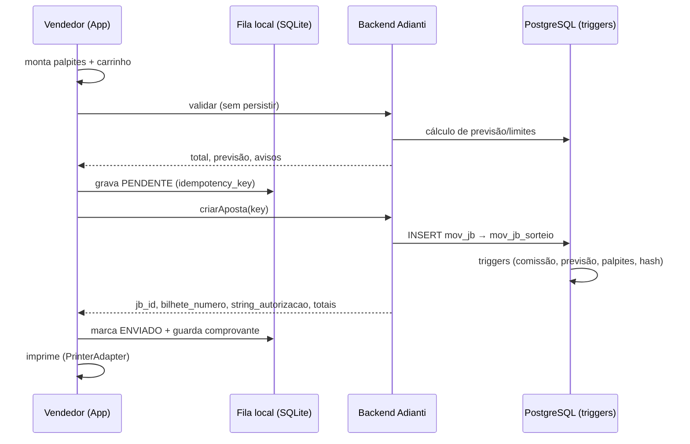
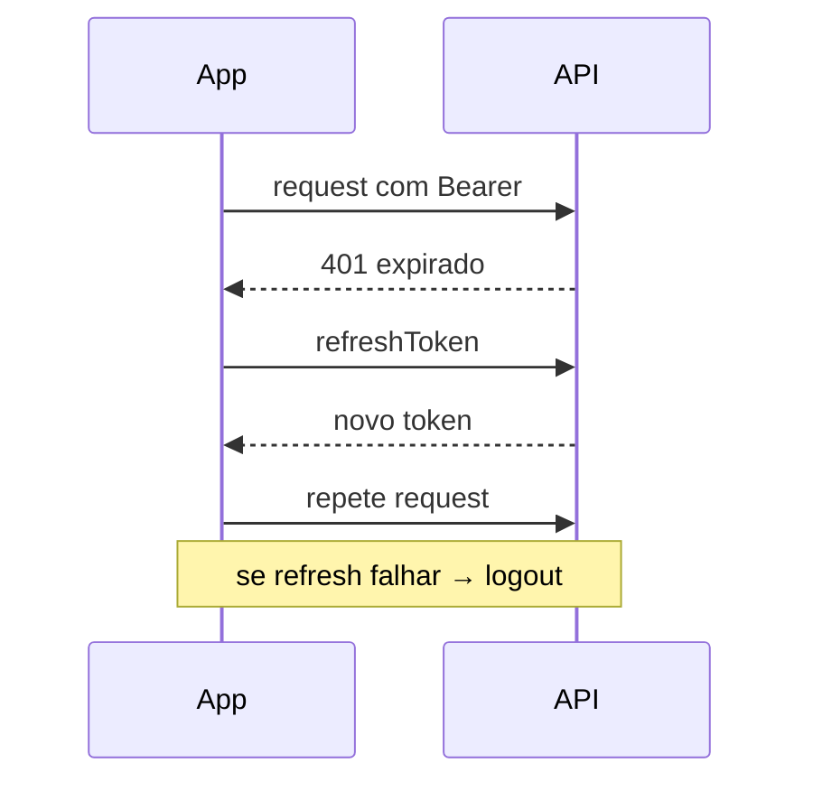

# Plano Técnico de Desenvolvimento — App Zooloo

**Aplicativo mobile (Expo / React Native + TypeScript) para registro de apostas dos jogos Bicho, Lotinha, Quininha e Seninha, integrado ao backend PHP/Adianti via REST + JWT.**

> Versão revisada e alinhada ao `banco_migrado.sql` (PostgreSQL). Substitui a versão anterior do `plano.md`, que era um _prompt_ de geração e não um plano executável. Esta versão parte da análise concreta do schema migrado, dos dados legados (`jogo_do_bicho.sql`, `lotinha_quininha_seninha.sql`) e da estrutura de código já existente do app.

---

## 0. Como ler este documento

- **Fonte de verdade de modelagem:** `banco_migrado.sql` (PostgreSQL 15). Os bancos legados foram usados apenas para confirmar o catálogo de jogos/modalidades e regras de negócio.
- **Marcadores:** `[CONFIRMADO NO SQL]` = lido diretamente da estrutura/dados; `[HIPÓTESE]` = inferência a validar; `[NÃO IDENTIFICADO NO SQL]` = lacuna real.
- **Princípio inegociável:** o app é **interface operacional**. Todo cálculo de prêmio, comissão, limite e verificação de ganhador é feito **no banco/backend** — nunca no app. Isso não é uma recomendação genérica: é como o sistema atual já funciona (ver Seção 2.4).

---

## 1. Resumo executivo

O App Zooloo é o ponto de venda (PDV) móvel do sistema administrativo Zooloo já existente. Ele permite que um **vendedor** autenticado registre apostas dos quatro jogos, gere e imprima um comprovante (pule), consulte resultados e histórico, e opere tanto em **celulares** quanto em **maquinetas POS Android** (com impressora térmica integrada).

**Módulos:**

| Módulo                 | Função                                                                                                        |
| ---------------------- | ------------------------------------------------------------------------------------------------------------- |
| Autenticação           | Login JWT, refresh, logout, recuperação de sessão, bloqueio de inativo                                        |
| Carga inicial          | Sincroniza parâmetros da banca, jogos ativos, modalidades, extrações/sorteios abertos, permissões do vendedor |
| Apostas                | Seleção de jogo → modalidade → extração/sorteio → palpites → carrinho → confirmação                           |
| Comprovante            | Geração, impressão térmica (ESC/POS), reimpressão (2ª via), QR/hash antifraude                                |
| Histórico & Resultados | Listagem de apostas do vendedor, detalhe, números sorteados, conferência de prêmio                            |
| Caixa                  | Consulta de saldo/lançamentos do vendedor (somente leitura no MVP)                                            |
| Configurações          | Tema claro/dark, impressora Bluetooth, perfil, modo offline                                                   |

**Integrações necessárias:** REST/Adianti (`engine.php`/`rest.php`), impressora térmica (Bluetooth clássico SPP **ou** SDK nativo da maquineta), armazenamento seguro do token, fila offline.

**Plataformas-alvo:**

1. **Celular do vendedor** (Android/iOS) — impressão via Bluetooth térmico externo.
2. **Maquineta POS Android** (ex.: Sunmi, Gertec, PAX, Positivo L4) — impressora **interna** acessada por SDK nativo do fabricante, não por Bluetooth.

> Implicação imediata: a camada de impressão precisa ser **abstraída por interface** (`PrinterAdapter`), com implementações distintas para Bluetooth externo e para SDK de maquineta. Detalhado na Seção 9.

---

## 2. Análise do banco de dados (`banco_migrado.sql`)

PostgreSQL, schema `public`. **78 tabelas, 9 views, 23 funções, 16 triggers.** Prefixos: `int_` (internas/catálogo), `cad_` (cadastros), `cfg_` (configuração), `mov_` (movimento/transacional), `data_` (auditoria de dados), `system_` (framework Adianti — usuários, permissões, logs).

### 2.1 Tabelas de catálogo e cadastro (leitura no app)

| Tabela                                            | Função                                                                       | Campos-chave                                                                                                                                                                   |
| ------------------------------------------------- | ---------------------------------------------------------------------------- | ------------------------------------------------------------------------------------------------------------------------------------------------------------------------------ |
| `int_jogo`                                        | **Catálogo dos jogos**                                                       | `jogo_id`, `filtro_banca`, `descricao`, `abreviacao`, `tamanho_max`, `qtd_colocacao_premio`, `orientacao`, `informar_valores_modalidade`                                       |
| `int_grupo`                                       | Os 25 bichos (grupo `01`–`25`) e suas 4 dezenas (00–99)                      | `final_grupo_id`, `grupo`, `descricao`                                                                                                                                         |
| `int_calculo_sorteio`                             | Tipo de cálculo da extração                                                  | `calculo_id`, `descricao`, `abreviacao`, `premiacao_maxima`                                                                                                                    |
| `cad_modalidade`                                  | **Modalidades configuradas pela banca** (instância jogável de um `int_jogo`) | `modalidade_id`, `jogo_id`, `apresentacao`, `multiplicador`, `multiplicador_colocacao_01..05`, `limite_palpite`, `limite_aceite`, `limite_descarga`                            |
| `cad_modalidade_jb` / `cad_modalidade_bilhetinho` | Parâmetros extras por modalidade (JB / bilhetinho)                           | `multiplicador`, `limite_palpite_min/max`, `limite_aceite`                                                                                                                     |
| `cad_extracao`                                    | **Extração** (loteria/horário-base)                                          | `extracao_id`, `filtro_banca`, `descricao`, `descricao_mobile`, `hora_limite`, dias da semana (`segunda`..`domingo`), `premiacao_maxima`, `extracao_instantanea`, `calculo_id` |
| `cad_area`                                        | Banca/região                                                                 | `area_id`, `descricao`                                                                                                                                                         |
| `cad_coletor`                                     | Coletor (ponto/dispositivo de coleta)                                        | `coletor_id`, `area_id`, `usuario_id`                                                                                                                                          |
| `cad_vendedor`                                    | **Vendedor** — entidade central do PDV                                       | ver 2.5                                                                                                                                                                        |
| `cad_terminal`                                    | Terminal/maquineta física                                                    | `terminal_id`, `vendedor_id`, `tipo`, `serial`, `multi_usuario`                                                                                                                |
| `cad_pessoas`                                     | Cliente (apostador nominal, opcional)                                        | `pessoa_id`, `fone`, `nome`, `cpf`                                                                                                                                             |
| `cfg_parametros`                                  | **Parâmetros da banca** (dados do comprovante + flags de jogos ativos)       | `nome_banca`, `cnpj`, `mensagem_01..05`, `ativo_jb`, `ativo_quininha`, `ativo_seninha`, `ativo_lotinha`, `ativo_bilhetinho`, `ativo_instantaneo`, `qtde_num_mi/ci/mci`         |

### 2.2 Tabelas de configuração comercial (afetam preço/limite/comissão)

| Tabela                                                       | Regra que carrega                                                                                             |
| ------------------------------------------------------------ | ------------------------------------------------------------------------------------------------------------- |
| `cfg_extracao_modalidade`                                    | Quais modalidades estão liberadas em cada extração                                                            |
| `cfg_area_cotacao`                                           | Multiplicador (cotação) específico por área/extração/modalidade — **sobrepõe** `cad_modalidade.multiplicador` |
| `cfg_area_limite`                                            | Limite de palpite por área/modalidade                                                                         |
| `cfg_extracao_descarga`                                      | Limite de descarga por extração/modalidade                                                                    |
| `cfg_area_comissao_modalidade` / `cfg_vendedor_mod_comissao` | Comissão por área/modalidade/vendedor (cadeia de fallback — ver 2.4)                                          |
| `cfg_grade_comissao` / `_itens`                              | Grades de comissão reutilizáveis                                                                              |
| `cfg_palpite_cotado`                                         | Palpites com cotação especial (números "quentes" com multiplicador próprio)                                   |
| `cfg_coletor_area` / `cfg_area_extracao`                     | Vínculos de visibilidade                                                                                      |

### 2.3 Tabelas de movimento (escrita = aposta) — núcleo transacional

O sistema separa **dois fluxos de aposta paralelos** com estruturas espelhadas:

**Fluxo A — Bicho / Lotinha / Quininha / Seninha (principal):**

```
mov_jb                (cabeçalho do bilhete/pule)
  └─ mov_jb_sorteio   (1 linha por sorteio×modalidade do bilhete; agrega palpites, totais, comissão, prêmio)
       └─ mov_jb_sort_palpite  (1 linha por palpite; carrega prêmio e ganho por colocação 01..10)
```

**Fluxo B — Bilhetinho (centena simplificada):**

```
mov_bilhetinho
  └─ mov_bilhetinho_sorteio
       └─ mov_bilhetinho_sort_palpite
```

| Tabela                                                       | Campos críticos para o app                                                                                                                                                                                                                                                                                                                                              |
| ------------------------------------------------------------ | ----------------------------------------------------------------------------------------------------------------------------------------------------------------------------------------------------------------------------------------------------------------------------------------------------------------------------------------------------------------------- |
| `mov_jb`                                                     | `jb_id`, `area_id`, `coletor_id`, `terminal_id`, `vendedor_id`, `sorteios_ids` (CSV), `sorteios_quantidade`, `bilhete_numero`, `data_hora` (cliente), `data_hora_servidor` (preenchido por trigger), `nome_cliente`, `fone_cliente`, `total_bilhete`, `comissao_valor`, `string_autorizacao` (**hash do comprovante**), `cancelado`, `reimpressao`, `data_cancelamento` |
| `mov_jb_sorteio`                                             | `jb_sorteio_id`, `jb_id`, `sorteio_id`, `modalidade_id`, `palpites` (texto até 2000), `palpites_quantidade`, `colocao_inicial`, `colocao_final`, `valor_palpites`, `total_sorteio`, `comissao_sorteio` (**trigger**), `sorteado`, `sorteado_valor`, `previsao_premio` (**trigger**)                                                                                     |
| `mov_jb_sort_palpite`                                        | `palpite`, `valor_palpite`, `jogou_colocacao_01..10`, `premio_colocacao_01..10` (**trigger**), `ganhou_colocacao_01..10` (**trigger**), `pago_colocacao_01..10`, `ganhou_premio_total`                                                                                                                                                                                  |
| `mov_sorteio`                                                | `sorteio_id`, `extracao_id`, `sorteio_numero`, `data_sorteio`, `hora_sorteio`, `situacao` (`A`=aberto, `F`=fechado), `numeros_sorteados` (CSV)                                                                                                                                                                                                                          |
| `mov_caixa` / `mov_caixa_lancamentos` / `mov_caixa_operacao` | Caixa do vendedor; saldo calculado por trigger e por CHECK constraint                                                                                                                                                                                                                                                                                                   |

### 2.4 ⚠️ Triggers e funções — **a regra de negócio mora aqui** (risco nº 1)

Esta é a descoberta mais importante da análise e **redefine a arquitetura do backend REST**. O app **não calcula** prêmio nem comissão; ele insere os dados brutos da aposta e o banco preenche o resto. Os endpoints REST devem replicar exatamente essa cadeia de INSERTs e **ler de volta** os campos calculados.

| Trigger                                                                                | Tabela / evento                             | O que faz                                                                                                                                                                               | Impacto no app                                                                                                        |
| -------------------------------------------------------------------------------------- | ------------------------------------------- | --------------------------------------------------------------------------------------------------------------------------------------------------------------------------------------- | --------------------------------------------------------------------------------------------------------------------- |
| `func_trg_mv_jb_datahora`                                                              | `mov_jb` BEFORE INSERT                      | Preenche `data_hora_servidor = now()`                                                                                                                                                   | App envia `data_hora` do dispositivo; **a hora oficial é a do servidor**. Validar janela contra `data_hora_servidor`. |
| `func_trg_mv_jb_sorteio_comissao`                                                      | `mov_jb_sorteio` BEFORE INSERT              | Calcula `comissao_sorteio` via cadeia de fallback de 6 níveis (`cfg_vendedor_mod_comissao` por área→área+mod→mod→vendedor→…→`cad_vendedor.comissao`) e atualiza `mov_jb.comissao_valor` | Comissão **nunca** vem do app. App apenas exibe o que o backend retornar.                                             |
| `func_trg_mov_jb_sorteio_previsao`                                                     | `mov_jb_sorteio` BEFORE INSERT              | Calcula `previsao_premio` aplicando multiplicador da modalidade **ou** cotação de `cfg_area_cotacao` (com sobreposição por área/extração)                                               | A "previsão de prêmio" exibida no carrinho deve ser **calculada por endpoint de validação**, não no cliente.          |
| `func_trg_mv_jb_sorteio_atualiza_palpites`                                             | `mov_jb_sorteio` AFTER INS/UPD/DEL (21 KB!) | Explode `palpites` em N linhas de `mov_jb_sort_palpite`, preenchendo `premio_colocacao_01..10` e flags `jogou_colocacao_*`                                                              | O app envia palpites como **string agregada**; o desmembramento e a precificação por colocação são do banco.          |
| `func_trg_bilhetinho_bilhete`                                                          | `mov_bilhetinho_sorteio`                    | Idem para bilhetinho (lê `cad_modalidade_bilhetinho`)                                                                                                                                   | —                                                                                                                     |
| `func_trg_mv_sorteio_regular` (32 KB)                                                  | `mov_sorteio` AFTER INS/UPD                 | **Verifica ganhadores do Jogo do Bicho** ao lançar `numeros_sorteados` (milhar/centena/dezena/grupo/passe/duque/terno…)                                                                 | Conferência de prêmio é responsabilidade do servidor; o app só **consulta** `ganhou_colocacao_*`.                     |
| `func_trg_mv_sorteio_lotinha`                                                          | `mov_sorteio`                               | Verifica ganhadores **Lotinha** (`filtro_banca = 4`) usando contenção de arrays (`@>`) sobre dezenas                                                                                    | —                                                                                                                     |
| `func_trg_mv_sorteio_qui_sen`                                                          | `mov_sorteio`                               | Verifica ganhadores **Quininha (`filtro 2`) / Seninha (`filtro 3`)**; lógica de acerto por colocação (quina/quadra/terno) com `generate_series`                                         | —                                                                                                                     |
| `func_trg_mv_jb_sorteio_pagamento`                                                     | `mov_jb_sort_palpite` AFTER UPD             | Recalcula `sorteado_valor_pago` quando uma colocação é marcada como paga                                                                                                                | Pagamento de prêmio é fluxo do admin; no app, somente leitura no MVP.                                                 |
| `func_trg_cad_extracao_criar_sorteio` / `func_trg_mv_sorteio_cria_novo_sorteio_aberto` | `cad_extracao` / `mov_sorteio`              | **Geram automaticamente o próximo `mov_sorteio` aberto** quando uma extração é ativada ou um sorteio é fechado, respeitando dias da semana e `hora_limite`                              | App **não cria sorteios**; apenas lista os abertos retornados pelo backend.                                           |
| `func_trg_cad_modalidade_mist`                                                         | `cad_modalidade` AFTER INSERT               | Cria extração "MILHAR INSTANTANEA" automaticamente p/ modalidade `MINST`                                                                                                                | Relevante só para admin.                                                                                              |
| `func_trg_mov_caixa_calcula_saldo` / `_lancamentos` / `_ai1`                           | `mov_caixa*`                                | Mantêm saldo e lançamentos consistentes                                                                                                                                                 | Caixa é derivado; app lê de `vw_caixa_result`.                                                                        |

### 2.5 `cad_vendedor` — fonte das permissões operacionais do app `[CONFIRMADO NO SQL]`

O comportamento do PDV é parametrizado por flags **no próprio vendedor** — o app **deve** carregá-las e respeitá-las na UI:

| Campo                                                                                                                            | Controla no app                                                                                               |
| -------------------------------------------------------------------------------------------------------------------------------- | ------------------------------------------------------------------------------------------------------------- |
| `comissao`, `exibe_comissao`, `exibe_premiacao`                                                                                  | Se mostra comissão/prêmio nas telas                                                                           |
| `limite_venda`, `tipo_limite`                                                                                                    | Teto de venda                                                                                                 |
| `pode_cancelar`, `pode_cancelar_tempo`, `pode_cancelar_qtde`                                                                     | Botão cancelar + janela de tempo + cota                                                                       |
| `pode_reimprimir`, `pode_reimprimir_qtde`, `pode_reimprimir_tempo`, `pode_reimprimir_*_outro`, `pode_reimprimir_sort_pago/naopg` | Reimpressão (2ª via): se pode, quantas vezes, em que janela, se de outro vendedor, conforme status do sorteio |
| `pode_pagar`, `pode_pagar_outro`                                                                                                 | Pagamento de prêmio                                                                                           |
| `treinamento`                                                                                                                    | Modo treino (não contabiliza)                                                                                 |
| `usuario_id` → `system_users.id`                                                                                                 | **Vínculo do login JWT ao vendedor**                                                                          |

> **Ponto crítico de integração:** o login do app autentica em `system_users` (framework Adianti), mas a operação acontece sobre `cad_vendedor`. O backend precisa resolver `system_users.id → cad_vendedor` (via `cad_vendedor.usuario_id`) e devolver o `vendedor_id` + flags no payload de login/carga inicial. `[HIPÓTESE — validar se a relação é 1:1]`

### 2.6 Views úteis (prontas para endpoints de leitura)

| View                               | Uso no app                                                                                                                                                               |
| ---------------------------------- | ------------------------------------------------------------------------------------------------------------------------------------------------------------------------ |
| `vw_vendajb`                       | **Histórico/detalhe de venda do Bicho/Lotinha/Qui/Sen** — já junta vendedor, modalidade, extração, sorteio, números sorteados, previsões de prêmio por colocação, status |
| `vw_venda`                         | Histórico do bilhetinho                                                                                                                                                  |
| `vw_comprovante`                   | Dados consolidados para montar o comprovante do bilhetinho                                                                                                               |
| `vw_confere` / `vw_venda_papitejb` | Conferência de palpites premiados                                                                                                                                        |
| `vw_sorteio`                       | Lista de sorteios + dados da extração (inclui `descricao_mobile`, `hora_limite`)                                                                                         |
| `vw_modalidade`                    | Multiplicador efetivo por modalidade (resolve jogos combinados 9/10/18/19)                                                                                               |
| `vw_premiojb`, `vw_caixa_result`   | Relatórios / caixa                                                                                                                                                       |

### 2.7 Pontos de atenção e riscos do banco

1. **`palpites` é string posicional, não relacional** (ex.: centenas concatenadas em blocos de 3–4 chars com separadores). O parsing/serialização precisa espelhar exatamente o que as triggers esperam. `[RISCO ALTO — exige amostras reais de cada modalidade]`
2. **Sem coluna de idempotência nativa.** `string_autorizacao` parece ser hash pós-fato, não chave de deduplicação na entrada. Precisamos introduzir uma chave de idempotência (Seção 10).
3. **Datas como `varchar`** em tabelas `system_*` (padrão Adianti) — tratar conversão.
4. **`mov_jb.sorteios_ids` é CSV** — uma pule pode cobrir vários sorteios; o app precisa montar isso corretamente.
5. **Não há tabela de "impressora" nem de "fila offline"** no banco. São conceitos exclusivos do app/local. `[NÃO IDENTIFICADO NO SQL]`
6. Verificação de ganhador depende de `extraiDigitosDireitaArray` e operadores de array — **impossível replicar com fidelidade no app**; confirma que conferência é server-side.

---

## 3. Análise das modalidades de jogo

### 3.1 Mapa dos quatro jogos `[CONFIRMADO NO SQL — int_jogo + filtro_banca]`

| Jogo              | `filtro_banca` | `jogo_id`(s)                                           | Trigger de conferência        | Flag de ativação (`cfg_parametros`) |
| ----------------- | -------------- | ------------------------------------------------------ | ----------------------------- | ----------------------------------- |
| **Jogo do Bicho** | 1              | 2,3,4,5,6,8,9,10,11,12,13,14,…,40 (muitas modalidades) | `func_trg_mv_sorteio_regular` | `ativo_jb`                          |
| **Quininha**      | 2              | 25                                                     | `func_trg_mv_sorteio_qui_sen` | `ativo_quininha`                    |
| **Seninha**       | 3              | 27                                                     | `func_trg_mv_sorteio_qui_sen` | `ativo_seninha`                     |
| **Lotinha**       | 4              | 37                                                     | `func_trg_mv_sorteio_lotinha` | `ativo_lotinha`                     |

> O app deve **filtrar jogos/extrações por `filtro_banca`** e **só exibir jogos com flag `ativo_*` = 'S'** em `cfg_parametros`.

### 3.2 Jogo do Bicho — modalidades `[CONFIRMADO NO SQL]`

`int_jogo` lista as modalidades; `tamanho_max` define o nº de dígitos do palpite; `qtd_colocacao_premio` define em quantas colocações o prêmio é dividido.

| Modalidade (exemplos)                               | Abrev          | `tamanho_max` | Como o jogador informa                                                                                                      |
| --------------------------------------------------- | -------------- | ------------- | --------------------------------------------------------------------------------------------------------------------------- |
| Milhar                                              | M              | 4             | 4 dígitos (0000–9999)                                                                                                       |
| Milhar invertida                                    | MI             | 10            | 4 dígitos; sistema gera permutações                                                                                         |
| Centena                                             | C              | 3             | 3 dígitos                                                                                                                   |
| Dezena                                              | D              | 2             | 2 dígitos                                                                                                                   |
| Grupo                                               | G              | 2             | nº do grupo 01–25 (bicho)                                                                                                   |
| Duque de Grupo / Dezena                             | DG/DD          | 5             | 2 grupos/dezenas                                                                                                            |
| Terno de Grupo / Dezena                             | TG/TD          | 8             | 3 grupos/dezenas                                                                                                            |
| Passe seco                                          | PS             | 5             | 2 grupos em ordem                                                                                                           |
| Milhar e Centena / MCD / etc.                       | MC, MCD        | 4             | "jogos combinados" — `informar_valores_modalidade='N'` ⇒ valores lançados nas modalidades-base separadas (ver `orientacao`) |
| Milhar Brinde / Trevo da Sorte / Milhar Instantânea | MB / M / MINST | 4             | variantes promocionais/instantâneas                                                                                         |

- **Validação no app:** comprimento = `tamanho_max`; apenas dígitos (grupo: 01–25); colocações dentro de `qtd_colocacao_premio`; valor entre `limite_palpite_min/max` (`cad_modalidade_jb`).
- **Validação obrigatória no backend:** limites de área/extração/descarga, cotação especial (`cfg_palpite_cotado`), janela de `hora_limite`, e **toda** a precificação.
- **Cálculo de valor total:** soma de `valor_palpite` por palpite × nº de colocações jogadas. `[a confirmar com amostras — string posicional]`
- **Cálculo de prêmio:** `valor_palpite × multiplicador_colocacao_NN` (ou cotação de `cfg_area_cotacao`). **Feito por trigger.**

> Para jogos combinados (`jogo_id` 9,10,18,19), `vw_modalidade` mostra que o multiplicador é a **soma** dos multiplicadores das modalidades-base. O app não deve tentar reproduzir isso — usar endpoint de validação.

### 3.3 Quininha (jogo 25) / Seninha (jogo 27) `[CONFIRMADO NO SQL]`

- Modalidades configuradas como "Quininha 13…45" e "Seninha 14…40" — o número indica a **faixa de dezenas disponíveis** para escolha; o multiplicador cai conforme a faixa aumenta (ex.: Quininha 13 → mult. 13; Quininha 45 → mult. 45, com `limite_min_sorteio_*` decrescente).
- **Quininha:** acerto principal sobre **5 dezenas**; colocações secundárias (quadra/terno) controladas por `multiplicador_colocacao_02..` e flags `sena_inc_quina`, `quina_inc_quadra`, `quina_inc_terno` em `cfg_parametros`.
- **Seninha:** acerto sobre **6 dezenas**; idem com `sena_inc_quina`, `sena_inc_quadra`.
- Conferência: trigger compara arrays de dezenas sorteadas (operador `@>`) — a 1ª colocação exige conter todos; colocações inferiores usam `generate_series` para acertos parciais.
- **Validação no app:** quantidade de dezenas escolhidas conforme a modalidade; dezenas 00–99 sem repetição.
- **Payload:** dezenas como string CSV/posicional na coluna `palpites`.

### 3.4 Lotinha (jogo 37) `[CONFIRMADO NO SQL]`

- `tamanho_max = 2` (dezenas), `filtro_banca = 4`.
- Conferência por contenção de array de dezenas (`func_trg_mv_sorteio_lotinha`), análoga à Quininha porém com regra própria de premiação por colocação.
- `[HIPÓTESE]` Quantidade exata de dezenas por bilhete e tabela de premiação a confirmar com a equipe (ver Seção 14).

### 3.5 Exemplo de payload de criação de aposta (proposto)

```json
{
  "class": "VendaRestService",
  "method": "criarAposta",
  "data": {
    "idempotency_key": "uuid-v4-gerado-no-app",
    "vendedor_id": 12,
    "terminal_id": 4,
    "nome_cliente": "João",
    "fone_cliente": "84999990000",
    "sorteios_ids": "101,102",
    "data_hora": "2026-05-22T14:03:00",
    "itens": [
      {
        "sorteio_id": 101,
        "modalidade_id": 25,
        "palpites": "12,25,33,40,07",
        "palpites_quantidade": 1,
        "colocao_inicial": 1,
        "colocao_final": 1,
        "valor_palpites": 2.0
      }
    ]
  }
}
```

Resposta inclui `jb_id`, `bilhete_numero`, `string_autorizacao`, `total_bilhete`, `comissao_valor` (lidos **após** os triggers) e o `previsao_premio` por item. **Nenhum desses valores é enviado pelo app.**

---

## 4. Modelo de domínio (app ↔ backend)

| Entidade              | Responsabilidade                             | Origem no SQL                                           | Controlada por                                 |
| --------------------- | -------------------------------------------- | ------------------------------------------------------- | ---------------------------------------------- |
| Usuário/Sessão        | Auth, JWT, perfil                            | `system_users`, `system_access_log`                     | Backend (app guarda token)                     |
| Vendedor              | Identidade operacional + permissões PDV      | `cad_vendedor`                                          | Backend (app lê e respeita flags)              |
| Área/Banca            | Agrupamento comercial                        | `cad_area`, `cfg_parametros`                            | Backend                                        |
| Terminal              | Maquineta/dispositivo                        | `cad_terminal`                                          | Backend (app envia `terminal_id`/serial)       |
| Jogo                  | Catálogo dos 4 jogos                         | `int_jogo` (+`filtro_banca`)                            | Backend (app lê)                               |
| Modalidade            | Variante jogável + multiplicadores/limites   | `cad_modalidade`(+`_jb`/`_bilhetinho`), `vw_modalidade` | Backend (app lê)                               |
| Grupo/Bicho           | 25 grupos × 4 dezenas                        | `int_grupo`                                             | Backend (app lê, cacheável)                    |
| Extração              | Loteria/horário                              | `cad_extracao`                                          | Backend                                        |
| Sorteio               | Ocorrência aberta de uma extração            | `mov_sorteio`, `vw_sorteio`                             | **Backend (gerado por trigger; app só lista)** |
| Aposta (bilhete/pule) | Cabeçalho da venda                           | `mov_jb` / `mov_bilhetinho`                             | App cria → Backend persiste                    |
| Item da aposta        | Sorteio×modalidade                           | `mov_jb_sorteio`                                        | App envia bruto → Backend/triggers calculam    |
| Palpite               | Número apostado + prêmio/ganho por colocação | `mov_jb_sort_palpite`                                   | **Backend/triggers**                           |
| Resultado             | Números sorteados                            | `mov_sorteio.numeros_sorteados`                         | Backend                                        |
| Prêmio                | `sorteado_valor`, `ganhou_colocacao_*`       | `mov_jb_sorteio`, `mov_jb_sort_palpite`                 | **Backend/triggers (somente leitura no app)**  |
| Comissão              | `comissao_sorteio`, `comissao_valor`         | trigger                                                 | **Backend**                                    |
| Caixa                 | Saldo/lançamentos                            | `mov_caixa*`, `vw_caixa_result`                         | Backend (leitura no MVP)                       |
| Comprovante/Recibo    | Layout impresso                              | derivado de `mov_jb`+`vw_*`                             | App (render) + Backend (hash)                  |
| Impressora            | Conexão física                               | — `[NÃO IDENTIFICADO NO SQL]`                           | **App (local)**                                |
| Fila offline          | Apostas pendentes de envio                   | — `[NÃO IDENTIFICADO NO SQL]`                           | **App (local, SQLite)**                        |

---

## 5. Arquitetura mobile

**Aproveitar o que já existe** (não refazer): o app já tem Expo Router (`app/(tabs)`, `app/login.tsx`, `app/_layout.tsx`), `AuthContext`, `hooks/use-auth.ts`, `services/auth.ts`, NativeWind + `assets/styles/colors.ts`/`fontFamily.ts`, componentes `themed-text`/`themed-view`, e `constants/theme.ts`. A arquitetura abaixo **estende** essa base.

### 5.1 Estrutura de pastas proposta (incremental)

```
app/                         # Expo Router (já existe) — adicionar rotas:
  (tabs)/
    index.tsx                # dashboard (existe)
    apostas.tsx              # nova
    historico.tsx            # nova
    resultados.tsx           # nova
    config.tsx               # nova
  aposta/
    [jogo].tsx               # seleção de modalidade/sorteio
    nova.tsx                 # criação de palpites
    carrinho.tsx
    confirmacao.tsx
  comprovante/[id].tsx
  login.tsx                  # existe
src/
  api/
    client.ts                # axios/fetch + interceptors (Bearer, refresh, erros)
    endpoints.ts             # mapa de class/method Adianti
    queryKeys.ts
  features/
    auth/                    # reaproveita AuthContext/use-auth/services/auth
    apostas/                 # lógica de cada jogo (validators por modalidade)
    impressao/
      PrinterAdapter.ts      # interface comum
      BluetoothPrinter.ts    # impressora externa (celular)
      PosPrinter.ts          # SDK maquineta (módulo nativo)
      escpos.ts              # geração de comandos / layout 58mm e 80mm
    offline/
      queue.ts               # fila SQLite + reenvio idempotente
      sync.ts
  store/                     # Zustand (estado global leve)
  theme/                     # design system (Seção 5.6)
  types/                     # contratos TS (Seção 8)
```

### 5.2 Navegação

Expo Router (já adotado). Stack para fluxos de aposta, Tabs para áreas principais, rota protegida que redireciona a `login` quando não há token válido (estender o guard já existente em `AuthContext`).

### 5.3 Estado

- **Servidor:** TanStack Query (cache, retry, invalidação) para modalidades, sorteios, histórico, resultados.
- **Cliente/global:** Zustand para sessão, carrinho de aposta, configuração de impressora, status de conectividade.
- **Formulários:** React Hook Form + Zod (validação por modalidade espelhando `tamanho_max`/`qtd_colocacao_premio`).

### 5.4 Camada de API e autenticação

- Cliente HTTP único com interceptors: injeta `Authorization: Bearer`, trata `401` → tenta `refreshToken` uma vez → repete; se falhar, logout.
- Padroniza a resposta Adianti `{status, data}` (Seção 7) e normaliza erros para `ErroApi`.
- **Token JWT** em `expo-secure-store` (Keychain/Keystore) — nunca em AsyncStorage. Validação de expiração proativa antes de operações críticas (criar aposta).

### 5.5 Offline, fila e antiduplicação

- **Banco local:** `expo-sqlite` (ou `op-sqlite`) com tabelas `fila_apostas`, `cache_modalidades`, `cache_sorteios`.
- Cada aposta recebe `idempotency_key` (UUID) **antes** de qualquer tentativa de envio.
- Fluxo: grava local `PENDENTE` → tenta enviar → on-success marca `ENVIADO` e guarda comprovante; on-falha mantém `PENDENTE` para reenvio (com a **mesma** key).
- O backend deduplica por `idempotency_key` (Seção 10) — reenvio nunca gera aposta duplicada.
- **Limitação honesta:** apostas têm `hora_limite`. Modo offline só é seguro se o backend **rejeitar** apostas cuja janela expirou no momento do recebimento. Offline para apostas é, portanto, **best-effort com risco de rejeição** — deixar explícito na UI. `[validar política com a equipe — Seção 14]`

### 5.6 Design system, tema claro e dark

Manter as paletas já especificadas (light com `primary #1F319D`, dark com `primary #5B6CFF`). Estrutura:

```
src/theme/
  colors.ts  light.ts  dark.ts  spacing.ts  typography.ts  shadows.ts
  ThemeProvider.tsx  useAppTheme.ts
```

- `ThemeProvider` envolve o app; `useAppTheme()` expõe tokens.
- Modo `system | light | dark`; preferência persistida em `expo-secure-store`/AsyncStorage; detecção via `useColorScheme` (hook já existe no projeto).
- **Tokens centralizados** — nenhuma cor hardcoded em componentes; lint para proibir hex literais.
- Preparar tema para **customização futura por banca** (cores vindas de `cfg_parametros`).

**Regra de impressão:** o comprovante **não** segue o tema do app. O layout térmico é sempre monocromático/alto contraste (preto sobre branco), independente de light/dark. Isso evita ilegibilidade na bobina.

**Critérios de aceite do tema:** alternância funcional; preferência persistida; nenhuma tela com cor fora dos tokens; botões/inputs/cards/listas/modais legíveis nos dois temas; recibo imune ao tema.

> **Bibliotecas a validar quanto à compatibilidade com Expo e Bluetooth/POS:** impressão é o ponto mais sensível — ver Seção 9. Confirmar versões contra o SDK do Expo em uso no projeto antes de fixar.

---

## 6. Telas do aplicativo

| Tela                           | Objetivo                    | Dados                                         | Ações               | Endpoints                             | Erros                                    | Validação                           |
| ------------------------------ | --------------------------- | --------------------------------------------- | ------------------- | ------------------------------------- | ---------------------------------------- | ----------------------------------- |
| Splash                         | Bootstrap                   | —                                             | Verifica token      | `validateToken`                       | Token inválido → Login                   | —                                   |
| Login                          | Autenticar                  | login/senha                                   | Entrar              | `login`                               | Credenciais inválidas, inativo, sem rede | Campos obrigatórios                 |
| Recuperação de sessão          | Restaurar                   | token seguro                                  | Auto                | `validateToken`/`refreshToken`        | Expirado → Login                         | —                                   |
| Dashboard                      | Visão do dia                | vendedor, saldo, sorteios abertos             | Navegar             | `cargaInicial`                        | Falha de carga                           | —                                   |
| Seleção de jogo                | Escolher jogo               | jogos `ativo_*` por `filtro_banca`            | Selecionar          | (cache)                               | Jogo inativo                             | Só jogos ativos                     |
| Seleção de modalidade/extração | Configurar aposta           | `cad_modalidade`, `vw_sorteio`                | Escolher            | `listarModalidades`, `listarSorteios` | Sorteio fechado                          | `hora_limite` futura                |
| Criação de palpites            | Inserir números             | regras da modalidade                          | Add/remover palpite | (validar)                             | Palpite inválido                         | `tamanho_max`, faixa, sem repetição |
| Carrinho/bilhete               | Conferir antes de confirmar | itens, total **estimado**, previsão de prêmio | Editar/remover      | `validarAposta`                       | Estouro de limite                        | Total/limites server-side           |
| Confirmação                    | Persistir                   | resumo                                        | Confirmar           | `criarAposta` (idempotente)           | Falha de rede → fila                     | Dupla confirmação evitada           |
| Comprovante                    | Exibir pule                 | `mov_jb`+`vw_*`, hash, QR                     | Imprimir            | (local)                               | —                                        | —                                   |
| Impressão                      | Enviar à impressora         | layout 58/80mm                                | Imprimir/retry      | (local/SDK)                           | Sem impressora, falha                    | —                                   |
| Reimpressão                    | 2ª via                      | bilhete                                       | Reimprimir          | `reimprimirComprovante`               | Sem permissão/cota                       | flags `pode_reimprimir_*`           |
| Histórico                      | Listar vendas               | `vw_vendajb`/`vw_venda`                       | Filtrar, abrir      | `listarApostas`                       | Vazio                                    | —                                   |
| Detalhe da aposta              | Ver pule                    | item completo                                 | Reimprimir/cancelar | `detalheAposta`                       | —                                        | —                                   |
| Cancelamento                   | Anular                      | bilhete                                       | Cancelar            | `cancelarAposta`                      | Sem permissão/janela                     | flags `pode_cancelar_*`             |
| Resultados                     | Conferir                    | `numeros_sorteados`, ganho                    | Filtrar             | `buscarResultados`                    | —                                        | —                                   |
| Caixa                          | Saldo do dia                | `vw_caixa_result`                             | —                   | `consultarCaixa`                      | —                                        | —                                   |
| Configuração impressora        | Parear/testar               | dispositivos                                  | Parear, testar      | (local/SDK)                           | Falha BT                                 | —                                   |
| Perfil/Config                  | Tema, sessão                | vendedor                                      | Trocar tema, logout | `logout`                              | —                                        | —                                   |

---

## 7. Integração com backend Adianti

Ponto de entrada: `engine.php`/`rest.php` recebe `{class, method, data}`. Login via `ApplicationAuthenticationRestService.login` (sem token); demais rotas exigem `Authorization` (Basic `rest_key` ou Bearer JWT); usuário autenticado injetado em `_auth`.

**Convenção de resposta** a normalizar no app:

```json
{ "status": "success", "data": { } }
{ "status": "error",   "data": "mensagem" }
```

| Endpoint lógico      | Classe PHP sugerida                    | Método               | Request (`data`)            | Response (`data`)                                                                     | Bearer | Erros                     | Obs                                                                      |
| -------------------- | -------------------------------------- | -------------------- | --------------------------- | ------------------------------------------------------------------------------------- | ------ | ------------------------- | ------------------------------------------------------------------------ |
| Login                | `ApplicationAuthenticationRestService` | `login`              | `{login,password}`          | `{user, token, expires_at, vendedor, permissoes}`                                     | Não    | inválido/inativo          | **resolver `system_users`→`cad_vendedor` e devolver flags**              |
| Validar token        | mesma                                  | `validateToken`      | `{}`                        | `{valid:true}`                                                                        | Sim    | expirado                  | —                                                                        |
| Refresh              | mesma                                  | `refreshToken`       | `{}`                        | `{token, expires_at}`                                                                 | Sim    | inválido                  | rotacionar                                                               |
| Logout               | mesma                                  | `logout`             | `{}`                        | `{}`                                                                                  | Sim    | —                         | registra `system_access_log`                                             |
| Carga inicial        | `CargaInicialRestService`              | `obter`              | `{vendedor_id}`             | `{parametros, jogos, modalidades, grupos, sorteios_abertos, permissoes}`              | Sim    | —                         | 1 chamada para hidratar caches                                           |
| Listar modalidades   | `ModalidadeRestService`                | `listar`             | `{jogo_id, extracao_id}`    | `[modalidade]`                                                                        | Sim    | —                         | usar `vw_modalidade`                                                     |
| Regras de modalidade | `ModalidadeRestService`                | `regras`             | `{modalidade_id}`           | `{tamanho_max, qtd_colocacao_premio, limites, multiplicadores, orientacao}`           | Sim    | —                         | —                                                                        |
| Listar sorteios      | `SorteioRestService`                   | `abertos`            | `{filtro_banca, data}`      | `[sorteio]`                                                                           | Sim    | —                         | usar `vw_sorteio`, só `situacao='A'` e `hora_limite` futura              |
| **Validar aposta**   | `VendaRestService`                     | `validar`            | bilhete completo            | `{total, comissao, previsao_premio[], avisos[]}`                                      | Sim    | limite/janela             | **calcula sem persistir** (carrinho)                                     |
| **Criar aposta**     | `VendaRestService`                     | `criarAposta`        | bilhete + `idempotency_key` | `{jb_id, bilhete_numero, string_autorizacao, total_bilhete, comissao_valor, itens[]}` | Sim    | duplicado, limite, janela | **transação: INSERT mov_jb → mov_jb_sorteio → ler valores dos triggers** |
| Cancelar aposta      | `VendaRestService`                     | `cancelar`           | `{jb_id, motivo}`           | `{cancelado:true}`                                                                    | Sim    | sem permissão/janela      | checar flags `pode_cancelar_*` no servidor                               |
| Listar apostas       | `VendaRestService`                     | `listar`             | `{vendedor_id, periodo}`    | `[venda]`                                                                             | Sim    | —                         | `vw_vendajb`/`vw_venda`                                                  |
| Detalhe              | `VendaRestService`                     | `detalhe`            | `{jb_id}`                   | `{venda, itens, palpites}`                                                            | Sim    | —                         | —                                                                        |
| Resultados           | `ResultadoRestService`                 | `buscar`             | `{extracao_id, data}`       | `{numeros_sorteados, conferencia}`                                                    | Sim    | —                         | —                                                                        |
| Reimprimir           | `VendaRestService`                     | `reimprimir`         | `{jb_id}`                   | `{comprovante, reimpressao_n}`                                                        | Sim    | cota/permissão            | incrementa `reimpressao`, `data_reimpressao`                             |
| Sincronizar config   | `UsuarioRestService`                   | `salvarPreferencias` | `{tema, impressora}`        | `{}`                                                                                  | Sim    | —                         | opcional                                                                 |
| Log/auditoria do app | `AuditoriaRestService`                 | `registrar`          | `{evento, contexto}`        | `{}`                                                                                  | Sim    | —                         | login/logout/criar/cancelar/reimprimir                                   |

> **Regra de ouro do `criarAposta`:** o serviço PHP deve inserir os dados brutos e **reler** as colunas preenchidas pelos triggers (`comissao_sorteio`, `previsao_premio`, `premio_colocacao_*`, `string_autorizacao`) dentro da mesma transação, devolvendo-as ao app. O app **não recalcula nada**.

---

## 8. Contratos TypeScript (essenciais)

```typescript
export interface ApiResponse<T> {
  status: "success" | "error";
  data: T | string;
}
export interface ErroApi {
  code: string;
  message: string;
  field?: string;
}

export interface User {
  id: number;
  login: string;
  name: string;
  email: string;
  active: "Y" | "N";
}
export interface AuthResponse {
  user: User;
  token: string;
  expires_at: string;
  vendedor: Vendedor;
  permissoes: PermissoesVendedor;
}

export interface Vendedor {
  vendedor_id: number;
  area_id: number;
  coletor_id: number;
  nome: string;
  comissao: number;
  limite_venda: number;
  tipo_limite?: string;
  treinamento: "S" | "N";
}
export interface PermissoesVendedor {
  exibe_comissao: "S" | "N";
  exibe_premiacao: "S" | "N";
  pode_cancelar: "S" | "N";
  pode_cancelar_qtde: number;
  pode_cancelar_tempo: string;
  pode_reimprimir: "S" | "N";
  pode_reimprimir_qtde: number;
  pode_reimprimir_tempo: string;
  pode_pagar: "S" | "N";
}

export interface Jogo {
  jogo_id: number;
  filtro_banca: number;
  descricao: string;
  abreviacao: string;
  tamanho_max: number;
  qtd_colocacao_premio: number;
  orientacao?: string;
  informar_valores_modalidade: "S" | "N";
  ativo: "S" | "N";
}
export interface Modalidade {
  modalidade_id: number;
  jogo_id: number;
  apresentacao: string;
  multiplicador: number | null;
  multiplicador_colocacao_01?: number; /* ...02..05 */
  limite_palpite?: number;
  limite_aceite?: number;
}
export interface RegraModalidade {
  tamanho_max: number;
  qtd_colocacao_premio: number;
  limite_palpite_min?: number;
  limite_palpite_max?: number;
  multiplicadores: number[];
  orientacao?: string;
}
export interface Sorteio {
  sorteio_id: number;
  extracao_id: number;
  descricao: string;
  descricao_mobile: string;
  data_sorteio: string;
  hora_limite: string;
  situacao: "A" | "F";
}

export interface ItemAposta {
  sorteio_id: number;
  modalidade_id: number;
  palpites: string;
  palpites_quantidade: number;
  colocao_inicial: number;
  colocao_final: number;
  valor_palpites: number;
}
export interface Aposta {
  idempotency_key: string;
  vendedor_id: number;
  terminal_id?: number;
  sorteios_ids: string;
  nome_cliente?: string;
  fone_cliente?: string;
  data_hora: string;
  itens: ItemAposta[];
}
export interface ApostaConfirmada {
  jb_id: number;
  bilhete_numero: number;
  string_autorizacao: string;
  total_bilhete: number;
  comissao_valor: number;
  itens: Array<
    ItemAposta & { previsao_premio: number; comissao_sorteio: number }
  >;
}

export interface Resultado {
  extracao_id: number;
  data_sorteio: string;
  numeros_sorteados: string;
}
export interface Boleto {
  jb_id: number;
  bilhete_numero: number;
  string_autorizacao: string;
  data_hora: string;
  vendedor_nome: string;
  nome_banca: string;
  itens: ItemAposta[];
  total_bilhete: number;
  mensagens: string[];
  reimpressao: number;
}
export interface Impressora {
  id: string;
  nome: string;
  tipo: "bluetooth" | "pos_interna";
  larguraMm: 58 | 80;
  conectada: boolean;
}
```

---

## 9. Impressão — Bluetooth térmico **e** maquineta POS

Esta é a área de maior risco técnico e a que mais difere da versão anterior do plano (que assumia só Bluetooth). **Há dois cenários físicos distintos:**

### 9.1 Dois caminhos de hardware

| Cenário                   | Hardware                             | Como imprimir                                                                                          |
| ------------------------- | ------------------------------------ | ------------------------------------------------------------------------------------------------------ |
| **Celular do vendedor**   | Impressora térmica externa (58/80mm) | Bluetooth **clássico (SPP)** na maioria das térmicas baratas; algumas usam **BLE**                     |
| **Maquineta POS Android** | Impressora **interna**               | **SDK nativo do fabricante** (Sunmi/Gertec/PAX/Positivo) — não é Bluetooth; é chamada de módulo nativo |

> Consequência arquitetural: definir uma interface `PrinterAdapter` (`conectar`, `imprimir(buffer)`, `status`) e implementações `BluetoothPrinter` e `PosPrinter`. A tela de configuração detecta o ambiente e oferece o caminho certo.

### 9.2 Limitações do Expo

- **Expo Go não suporta** Bluetooth nativo nem SDK de maquineta.
- Será necessário **Expo Dev Client** + **config plugins** (e provavelmente módulos nativos custom), o que na prática significa **prebuild / fluxo "bare-friendly"** via EAS Build. Não dá para validar impressão dentro do Expo Go.
- Bibliotecas candidatas (a validar versão contra o Expo SDK do projeto): pacotes de ESC/POS Bluetooth para RN; para POS, o SDK do fabricante via módulo nativo. **Não fixar versão antes de testar em hardware real.**

### 9.3 ESC/POS e layout

- Geração de comandos ESC/POS própria (`escpos.ts`): alinhamento, negrito, tamanho de fonte, corte, QR Code.
- **Dois layouts:** 58mm (~32 col) e 80mm (~48 col), selecionados por `Impressora.larguraMm`.
- Layout sempre monocromático/alto contraste, **independente do tema** do app.

### 9.4 Pareamento, reconexão e falhas

- Tela de seleção/pareamento com lista de dispositivos; botão **teste de impressão**.
- Reconexão automática ao último dispositivo salvo (id em storage).
- Tratamento de falha: se a impressão falhar, a **aposta já está confirmada** no servidor — oferecer **reimpressão** sem recriar a venda (a `string_autorizacao` é a mesma).

### 9.5 Conteúdo mínimo do comprovante (pule)

Identificador único (`bilhete_numero`/`jb_id`) · data/hora (servidor) · vendedor/banca · jogo+modalidade · números apostados · valor por item · valor total · previsão de prêmio (se `exibe_premiacao='S'`) · **código de autenticação (`string_autorizacao`)** · QR Code para conferência · status · indicação de **2ª via** quando `reimpressao > 0` · mensagens legais (`cfg_parametros.mensagem_01..05`, incluindo "PROIBIDO PARA MENORES DE 18 ANOS").

---

## 10. Segurança e compliance

- **Operação somente legal/autorizada**; mensagens legais obrigatórias impressas (banca já cadastra "PROIBIDO PARA MENORES DE 18 ANOS" em `cfg_parametros`).
- **Controle de acesso por perfil** = flags de `cad_vendedor`, aplicadas **no backend** e refletidas na UI.
- **JWT em armazenamento seguro** (`expo-secure-store`); **HTTPS obrigatório**; rejeitar HTTP.
- **Nunca confiar em cálculo do app** — total, comissão, prêmio e ganhador são server-side (reforçado pelos triggers).
- **Idempotência:** introduzir `idempotency_key` por aposta. O backend mantém um índice/única (tabela auxiliar ou coluna nova em `mov_jb`) para deduplicar. `[REQUER MUDANÇA NO BACKEND/SCHEMA — destacar à equipe]`
- **Antiduplicação adicional:** UI bloqueia duplo-tap na confirmação; estado do carrinho limpo após sucesso.
- **Auditoria:** registrar login, logout, criação, cancelamento, reimpressão (endpoint de auditoria + tabelas `system_access_log`, `data_jb_sort_palpite` que já registra usuário/data).
- **Sessão:** expiração de token tratada proativamente; **bloqueio de vendedor inativo** (`cad_vendedor.ativo`, `system_users.active`).
- **Rate limit** no backend para `criarAposta`/`login`.
- **LGPD:** dados de cliente (`cad_pessoas`: nome/CPF/fone) são opcionais — coletar só o necessário; não persistir CPF localmente; termo de aceite (`accepted_term_policy`).
- **Hash do recibo:** `string_autorizacao` como assinatura antifraude; QR aponta para conferência server-side.

---

## 11. Fluxos principais

### 11.1 Criação e confirmação de aposta



### 11.2 Expiração / refresh



Demais fluxos (login, carga inicial, reimpressão, cancelamento, logout) seguem o mesmo padrão: app coleta → backend valida flags/limites → persiste → app reflete. Reimpressão e cancelamento **verificam permissão no servidor** antes de executar.

---

## 12. Roadmap por fases

> Ordenado por dependência. Fase 0 é **bloqueante** — sem ela, as fases de aposta não podem ser implementadas com fidelidade.

### Fase 0 — Descoberta de regras (BLOQUEANTE) `[NOVA]`

- **Entregáveis:** amostras reais do formato da coluna `palpites` para **cada** modalidade dos 4 jogos; mapa string-posicional ↔ palpites; confirmação das regras de Lotinha; tabela de premiação por colocação; política de `hora_limite`/offline; decisão sobre idempotência no backend.
- **Dependências:** acesso aos dados legados + equipe de negócio.
- **Riscos:** parsing incorreto de palpites → apostas inválidas/prêmios errados.
- **Aceite:** documento "Regras das Modalidades" validado; um exemplo de payload aprovado por jogo.

### Fase 1 — Backend REST

- **Entregáveis:** `Auth` (login/refresh/logout/validate) com resolução `system_users→cad_vendedor`+flags; `CargaInicial`; `Modalidade`/`Sorteio` (leitura via views); `Venda.validar`/`criarAposta` (transação + releitura de triggers + idempotência); `cancelar`/`reimprimir`/`listar`/`detalhe`; `Resultado`; auditoria.
- **Dependências:** Fase 0.
- **Riscos:** divergência entre o que o app envia e o que os triggers esperam.
- **Aceite:** criar/validar/listar aposta de cada jogo via Postman, com valores conferidos contra o admin Zooloo.

### Fase 2 — Mobile base

- **Entregáveis:** estender Expo Router; API client com interceptors/refresh; SecureStore; Zustand+TanStack Query; carga inicial + caches SQLite; guard de rota.
- **Dependências:** Fase 1 (auth + carga).
- **Aceite:** login real, sessão persistida, dashboard com sorteios abertos.

### Fase 3 — Design system e temas `[pode correr em paralelo à Fase 2]`

- **Entregáveis:** tokens light/dark, `ThemeProvider`/`useAppTheme`, componentes base, alternância + persistência.
- **Aceite:** ver critérios na Seção 5.6.

### Fase 4 — Módulo de apostas

- **Entregáveis:** seleção jogo→modalidade→sorteio; validadores por modalidade (Zod) espelhando `tamanho_max`/colocações; carrinho com `validar`; confirmação idempotente; fila offline.
- **Dependências:** Fases 0,1,2.
- **Riscos:** regras de UI por jogo; estouro de limites.
- **Aceite:** aposta ponta-a-ponta dos 4 jogos, batendo com o backend.

### Fase 5 — Impressão (Bluetooth + POS)

- **Entregáveis:** `PrinterAdapter` + `BluetoothPrinter` + `PosPrinter`; `escpos.ts` 58/80mm; pareamento, teste, reconexão; reimpressão; QR/hash.
- **Dependências:** Fase 4 (comprovante existe); **Dev Client/EAS** (sai do Expo Go).
- **Riscos:** incompatibilidade Expo Go (esperada); instabilidade BT; variação de SDK por fabricante.
- **Aceite:** impressão real em ≥1 impressora BT **e** ≥1 maquineta-alvo; 2ª via correta.

### Fase 6 — Segurança, QA, publicação

- **Entregáveis:** testes (unit/validators/e2e dos fluxos críticos), auditoria ponta-a-ponta, rate limit, build Android (EAS), build iOS se aplicável, homologação com banca real.
- **Aceite:** checklist de segurança (Seção 10) cumprido; homologação assinada.

---

## 13. Riscos técnicos e mitigação

| Risco                                                             | Severidade | Mitigação                                                                               |
| ----------------------------------------------------------------- | ---------- | --------------------------------------------------------------------------------------- |
| Regra de negócio escondida em triggers (comissão/prêmio/ganhador) | **Alta**   | Backend replica a cadeia de INSERTs e **relê** valores; app não calcula nada (Fase 0/1) |
| Formato posicional de `palpites` mal interpretado                 | **Alta**   | Fase 0 bloqueante com amostras reais; testes comparando com admin                       |
| Incompatibilidade Bluetooth/POS com Expo Go                       | Alta       | Dev Client + EAS desde a Fase 5; `PrinterAdapter` por ambiente                          |
| Instabilidade de impressora                                       | Média      | Reimpressão idempotente; venda confirmada independe da impressão                        |
| Apostas duplicadas                                                | Alta       | `idempotency_key` + dedupe no backend + bloqueio de UI                                  |
| Token expira durante operação                                     | Média      | Refresh proativo antes de `criarAposta`; retry único                                    |
| Divergência app × backend (totais/limites)                        | Alta       | Endpoint `validar` server-side é a fonte de verdade do carrinho                         |
| Aposta offline fora da janela `hora_limite`                       | Média      | Backend rejeita no recebimento; UI avisa que offline é best-effort                      |
| Vínculo `system_users`↔`cad_vendedor` ambíguo                     | Média      | Validar na Fase 0; tratar 1:N se existir                                                |
| Falta de ambiente de homologação                                  | Média      | Banca de testes (`treinamento='S'`) antes de produção                                   |

---

## 14. Perguntas para o cliente/equipe

**Modalidades/palpites**

1. Qual o formato **exato** da string `palpites` para cada modalidade dos 4 jogos? (precisamos de 1 exemplo real por modalidade)
2. Para jogos combinados (Milhar e Centena, MCD, etc.), como o app deve coletar e enviar os valores separados?
3. Lotinha: quantas dezenas por bilhete e qual a tabela de premiação por colocação?
4. Quininha/Seninha: quais combinações de `sena_inc_*`/`quina_inc_*` estão ativas nesta banca?

**Limites/prêmios/comissão** 5. Confirmar a ordem de precedência da cotação (`cfg_area_cotacao`) sobre `cad_modalidade.multiplicador`. 6. A "previsão de prêmio" exibida no comprovante deve sair do `validar` server-side em todos os casos?

**Operação** 7. `system_users.id ↔ cad_vendedor` é 1:1? Um usuário pode operar como vários vendedores/terminais? 8. Política de **cancelamento** e **reimpressão**: as flags de `cad_vendedor` são suficientes ou há regra adicional? 9. Como o `terminal_id`/`serial` da maquineta deve ser provisionado e enviado?

**Impressão** 10. Quais **modelos de maquineta** (fabricante/SDK) e quais **impressoras Bluetooth** precisam ser suportados no MVP? 11. Largura(s) de bobina oficial(is): 58mm, 80mm ou ambos?

**Offline/idempotência/legal** 12. Apostas **offline** são permitidas? Se sim, qual a tolerância em relação à `hora_limite`? 13. Podemos adicionar `idempotency_key` ao backend/schema (`mov_jb`)? 14. Requisitos legais/compliance específicos da jurisdição (idade, dados do cliente, retenção de logs)? 15. Existe ambiente de **homologação** com dados de teste, ou usaremos vendedor em modo `treinamento`?

---

_Documento de planejamento — não contém implementação de código. Cálculos críticos e validações finais são responsabilidade do backend/banco; o app é interface operacional._
