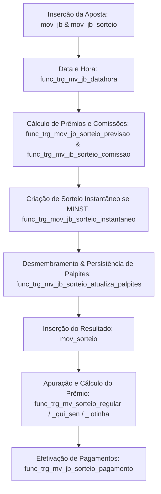

# Regras de Negócio e Lógica de Processamento - Jogo do Bicho

Esta documentação consolida as regras de negócio, formatos de palpites e fluxo de processamento mapeados diretamente a partir do schema de banco de dados (`jogo_do_bicho.sql`).

## 1. Mapa de Modalidades

A tabela abaixo mapeia as modalidades ativas no sistema, correlacionando-as com as definições de jogos internos (`int_jogo`) e as tabelas de movimentação:

| Modalidade (Apresentação) | Código/ID (Modalidade/Jogo) | Formato de Entrada Aceito | Formato Normalizado (DB) | Função de Validação | Trigger Associada | Observações |
| :--- | :--- | :--- | :--- | :--- | :--- | :--- |
| **Milhar** | Mod: `2` / Jogo: `2` | 4 dígitos numéricos (ex: `1234`). Múltiplos separados por vírgula. | Registro individual de 4 dígitos na coluna `palpite`. | ⚠️ Não identificado no schema | `trg_mv_jb_sorteio` (tabela `mov_jb_sorteio`) | Registrado na tabela `mov_jb_sort_palpite`. |
| **Centena** | Mod: `3` / Jogo: `4` | 3 dígitos numéricos (ex: `123`). Múltiplos separados por vírgula. | Registro individual de 3 dígitos na coluna `palpite`. | ⚠️ Não identificado no schema | `trg_mv_jb_sorteio` (tabela `mov_jb_sorteio`) | Registrado na tabela `mov_jb_sort_palpite`. |
| **Dezena** | Mod: `4` / Jogo: `8` | 2 dígitos numéricos (ex: `12`). Múltiplos separados por vírgula. | Registro individual de 2 dígitos na coluna `palpite`. | ⚠️ Não identificado no schema | `trg_mv_jb_sorteio` (tabela `mov_jb_sorteio`) | Registrado na tabela `mov_jb_sort_palpite`. |
| **Grupo** | Mod: `7` / Jogo: `6` | 2 dígitos numéricos de 01 a 25 (ex: `05`). Múltiplos por vírgula. | Registro individual de 2 dígitos na coluna `palpite`. | ⚠️ Não identificado no schema | `trg_mv_jb_sorteio` (tabela `mov_jb_sorteio`) | Mapeia o grupo do bicho (01 a 25). |
| **Milhar Invertida** | Mod: `11` / Jogo: `3` | String contendo de 3 a 4 dígitos (ex: `1234`). | Múltiplos registros de 4 dígitos (combinações permutadas) salvos na modalidade Milhar (`M`). | ⚠️ Não identificado no schema | `trg_mv_jb_sorteio` (tabela `mov_jb_sorteio`) | Desmembrado dinamicamente usando CTE recursiva na trigger. |
| **Centena Invertida** | Mod: `12` / Jogo: `5` | String contendo de 3 a 4 dígitos (ex: `123`). | Múltiplos registros de 3 dígitos (combinações permutadas) salvos na modalidade Centena (`C`). | ⚠️ Não identificado no schema | `trg_mv_jb_sorteio` (tabela `mov_jb_sorteio`) | Desmembrado dinamicamente usando CTE recursiva na trigger. |
| **Milhar e Centena Invertida** | Mod: `10` / Jogo: `10` | String de dígitos numéricos (ex: `1234`). | Múltiplos registros divididos entre Milhar (4 dígitos) e Centena (3 dígitos) contendo todas as permutações. | ⚠️ Não identificado no schema | `trg_mv_jb_sorteio` (tabela `mov_jb_sorteio`) | Desmembrado para as tabelas equivalentes de `M` e `C`. |
| **Milhar e Centena** | Mod: `1` / Jogo: `9` | 4 dígitos numéricos (ex: `1234`). Múltiplos separados por vírgula. | Desmembrado em dois registros por palpite: um de Milhar (4 dígitos) e um de Centena (últimos 3 dígitos). | ⚠️ Não identificado no schema | `trg_mv_jb_sorteio` (tabela `mov_jb_sorteio`) | Registra um palpite na modalidade Milhar (`M`) e outro na Centena (`C`). |
| **Milhar Centena Dezena** | Mod: `14` / Jogo: `18` | 4 dígitos numéricos (ex: `1234`). Múltiplos separados por vírgula. | Desmembrado em três registros por palpite: Milhar (4 dígitos), Centena (últimos 3 dígitos) e Dezena (últimos 2 dígitos). | ⚠️ Não identificado no schema | `trg_mv_jb_sorteio` (tabela `mov_jb_sorteio`) | Registra palpites nas modalidades `M`, `C` e `D`. |
| **Centena Dezena** | Mod: `15` / Jogo: `19` | 3 dígitos numéricos (ex: `123`). Múltiplos separados por vírgula. | Desmembrado em dois registros por palpite: Centena (3 dígitos) e Dezena (últimos 2 dígitos). | ⚠️ Não identificado no schema | `trg_mv_jb_sorteio` (tabela `mov_jb_sorteio`) | Registra palpites nas modalidades `C` e `D`. |
| **Quininha (13 a 45)** | Mod: `25-37` / Jogo: `25` | Lista de dezenas separadas por vírgula (ex: `01,15,22,43,59...`). Quantidade depende da modalidade (13 a 45 dezenas). | Salva a string original completa na coluna `palpite` (registro único). | ⚠️ Não identificado no schema | `trg_mv_jb_sorteio` (tabela `mov_jb_sorteio`) | Apurado usando operações de array `@>` comparando com os números sorteados. |
| **Seninha (14 a 40)** | Mod: `38-48` / Jogo: `27` | Lista de dezenas separadas por vírgula (ex: `02,11,18,34,55...`). Quantidade depende da modalidade (14 a 40 dezenas). | Salva a string original completa na coluna `palpite` (registro único). | ⚠️ Não identificado no schema | `trg_mv_jb_sorteio` (tabela `mov_jb_sorteio`) | Apurado usando operações de array `@>` comparando com os números sorteados. |
| **Lotinha (17 a 23)** | Mod: `50-56` / Jogo: `37` | Lista de dezenas separadas por vírgula (ex: `05,12,32,45...`). Quantidade depende da modalidade (17 a 23 dezenas). | Salva a string original completa na coluna `palpite` (registro único). | ⚠️ Não identificado no schema | `trg_mv_jb_sorteio` (tabela `mov_jb_sorteio`) | Apurado usando operações de array `@>` comparando com os números sorteados. |
| **Milhar Instantânea** | Criada dinamicamente / Jogo: `22` | 4 dígitos numéricos (ex: `1234`). | Registro individual de 4 dígitos na coluna `palpite`. | ⚠️ Não identificado no schema | `trg_mv_jb_sorteio_instantaneo` (tabela `mov_jb_sorteio`) | O sorteio é executado na hora pela função `func_sorteio_milhar_instanaea`. |
| **Milhar Brinde** | Mod: `13` / Jogo: `20` | 4 dígitos numéricos (ex: `1234`). | Registro individual de 4 dígitos na coluna `palpite`. | ⚠️ Não identificado no schema | `trg_mv_jb_sorteio` (tabela `mov_jb_sorteio`) | Previsão de prêmio força o valor do palpite para 1 (`func_trg_mov_jb_sorteio_previsao`). |
| **Milhar Brinde Progressiva** | Mod: `49` / Jogo: `28` | 4 dígitos numéricos (ex: `1234`). | Registro individual de 4 dígitos na coluna `palpite`. | ⚠️ Não identificado no schema | `trg_mv_jb_sorteio` (tabela `mov_jb_sorteio`) | O prêmio escala com base no valor total apostado no bilhete, limitado a 10 vezes. |

---

## 2. Fluxo de Processamento

O ciclo de vida completo de um palpite/aposta no sistema segue as seguintes etapas:

### Detalhamento das Etapas:

1. **Inserção do Cabeçalho e Metadados (Tabela `mov_jb`)**
   - O bilhete é criado inserindo as informações do cliente, vendedor e valor total do bilhete.
   - **Objeto Responsável:** Trigger `trg_mv_jb` (linha 676950) executa a função `public.func_trg_mv_jb_datahora()` (linha 711) antes da inserção (`BEFORE INSERT`), garantindo o carimbo de data e hora oficial do servidor na coluna `data_hora_servidor`.

2. **Cálculo da Previsão de Prêmio e Comissões (Tabela `mov_jb_sorteio`)**
   - Ao adicionar as modalidades da aposta associadas aos sorteios, o banco intercepta os dados para calcular a previsão máxima de premiação e a comissão devida ao vendedor.
   - **Previsão de Prêmio:** Trigger `trg_mv_jb_sorteio_previsao` (linha 676990) executa a função `public.func_trg_mov_jb_sorteio_previsao()` (linha 571). Ela calcula o multiplicador da aposta cruzando os dados da modalidade (`cad_modalidade.multiplicador`) com possíveis exceções (ex: soma de multiplicadores para jogos conjuntos ou limites e multiplicadores especiais da tabela `cfg_area_cotacao`), multiplicando pelo valor apostado para gravar na coluna `previsao_premio`.
   - **Cálculo de Comissão:** Trigger `trg_mv_jb_sorteio_comissao` (linha 676974) executa a função `public.func_trg_mv_jb_sorteio_comissao()` (linha 1127). Ela busca as regras de comissão baseadas no vendedor, área e modalidade a partir das configurações (`cfg_vendedor_mod_comissao` ou `cad_vendedor`), e atualiza a coluna `comissao_sorteio` e a comissão total acumulada do bilhete (`mov_jb.comissao_valor`).

3. **Associação ao Sorteio e Lógica Instantânea (Tabela `mov_jb_sorteio`)**
   - Para extrações normais, a aposta é apenas vinculada ao `sorteio_id` ativo. Para extrações instantâneas, o ciclo do sorteio ocorre no ato.
   - **Objeto Responsável:** Trigger `trg_mv_jb_sorteio_instantaneo` (linha 676982) executa a função `public.func_trg_mov_jb_sorteio_instantaneo()` (linha 519) antes de inserir a aposta. Caso seja uma Milhar Instantânea (`MINST`), ela cria automaticamente o sorteio com a situação `F` (Fechado) em `mov_sorteio`, associa-o à aposta e atualiza o bilhete principal.

4. **Desmembramento, Normalização e Persistência (Tabela `mov_jb_sort_palpite`)**
   - A string de palpites enviada pelo cliente é tratada, normalizada e persistida de forma estruturada.
   - **Objeto Responsável:** Trigger `trg_mv_jb_sorteio` (linha 676966) executa a função `public.func_trg_mv_jb_sorteio_atualiza_palpites()` (linha 734) no evento `AFTER INSERT OR DELETE OR UPDATE`.
   - **Ação:**
     - Limpa os palpites anteriormente gerados para a aposta se for uma alteração/exclusão.
     - Analisa os palpites enviados. Se for um jogo com desmembramento composto ou invertido (como `MI`, `CI`, `MC`, `MCD`, `CD`), a função quebra a string, calcula as permutações ou divide as frações e insere múltiplos registros na tabela `mov_jb_sort_palpite` vinculados ao mesmo `jb_sorteio_id`.
     - Caso o palpite conste na tabela `cfg_palpite_cotado` com status ativo, aplica o redutor da cotação especial ao prêmio.
     - Se o jogo for do tipo `MINST`, executa a simulação automática do sorteio chamando `public.func_sorteio_milhar_instanaea(jb_sorteio_id)` (linha 164).

5. **Apuração do Sorteio e Cálculo do Prêmio (Tabela `mov_sorteio`)**
   - O sorteio é finalizado e os números sorteados são lançados em `mov_sorteio.numeros_sorteados`. A inserção dos números dispara as triggers de apuração.
   - **Objetos Responsáveis:**
     - **Jogo do Bicho Regular:** Trigger `trg_mv_sorteio_verifica_ganhadores` (linha 677006) executa `public.func_trg_mv_sorteio_regular()` (linha 2117) para apurar os palpites do Jogo do Bicho comum, comparando milhares, centenas, dezenas e grupos (mapeando dezenas para grupos com base em `int_grupo`). O prêmio da aposta é calculado rateando o prêmio total ganho pelo número de colocações jogadas (`ijogo.qtd_colocacao_premio`).
     - **Quininha / Seninha:** Trigger `trg_mv_sorteio_verifica_ganhadores_qui_sen` (linha 677022) executa `public.func_trg_mv_sorteio_qui_sen()` (linha 1996) usando operações de interseção de arrays (`@>`) para verificar acertos de dezenas.
     - **Lotinha:** Trigger `trg_mv_sorteio_verifica_ganhadores_lotinha` (linha 677014) executa `public.func_trg_mv_sorteio_lotinha()` (linha 1919) usando lógica semelhante de arrays.
     - **Próximo Sorteio:** Trigger `trg_mv_sorteio_cria_sorteio_aberto` (linha 38) executa `public.func_trg_mv_sorteio_cria_novo_sorteio_aberto()` (linha 1261) ao fechar o sorteio, criando o próximo sorteio aberto para o próximo dia útil da extração.

6. **Efetivação de Pagamentos (Tabela `mov_jb_sort_palpite` & `mov_jb_sorteio`)**
   - Controla o pagamento dos palpites ganhadores individuais e atualiza o saldo pago do bilhete.
   - **Objeto Responsável:** Trigger `trg_mv_jb_sorteio` (linha 676966) executa `public.func_trg_mv_jb_sorteio_pagamento()` (linha 1203) no evento `AFTER UPDATE ON mov_jb_sort_palpite`. Ela acumula os valores pagos nas colocações individuais em `mov_jb_sorteio.sorteado_valor_pago` e marca `sorteado_pago = 'S'` quando o prêmio for integralmente quitado.

---

## 3. Regras de Validação por Modalidade

Não existem validações de formato ou restrições que gerem `RAISE EXCEPTION` de erro associadas aos palpites no schema SQL. A normalização e inserção dos palpites seguem as lógicas descritas abaixo (realizadas pela função `public.func_trg_mv_jb_sorteio_atualiza_palpites()`):

*   **Milhar (`M`) / Milhar Brinde (`MB`) / Milhar Brinde Progressiva (`MBP`) / Milhar Instantânea (`MINST`)**
    *   *Regex/Validação:* ⚠️ Não identificado no schema.
    *   *Transformação:* A string de palpites é fatiada em substrings de 4 caracteres (conforme `int_jogo.tamanho_max = 4`). Se houver múltiplos palpites separados por vírgula, eles são fatiados e gravados individualmente.
    *   *Erros/Exceções:* ⚠️ Não identificado no schema.
*   **Centena (`C`)**
    *   *Regex/Validação:* ⚠️ Não identificado no schema.
    *   *Transformação:* A string é fatiada em substrings de 3 caracteres (`tamanho_max = 3`).
    *   *Erros/Exceções:* ⚠️ Não identificado no schema.
*   **Dezena (`D`)**
    *   *Regex/Validação:* ⚠️ Não identificado no schema.
    *   *Transformação:* A string é fatiada em substrings de 2 caracteres (`tamanho_max = 2`).
    *   *Erros/Exceções:* ⚠️ Não identificado no schema.
*   **Grupo (`G`)**
    *   *Regex/Validação:* ⚠️ Não identificado no schema.
    *   *Transformação:* Palpites de 2 dígitos representando o grupo de animais (01 a 25) são fatiados e persistidos individualmente.
    *   *Erros/Exceções:* ⚠️ Não identificado no schema.
*   **Milhar Invertida (`MI`) / Centena Invertida (`CI`) / Milhar e Centena Invertida (`MCI`)**
    *   *Regex/Validação:* ⚠️ Não identificado no schema.
    *   *Transformação:* O palpite contendo múltiplos dígitos é desmembrado em todas as permutações matemáticas distintas e únicas possíveis (usando CTE `distinct` no PostgreSQL).
        *   Para Milhar (`MI`): Gera permutações de 4 dígitos e salva na modalidade Milhar (`M`).
        *   Para Centena (`CI`): Gera permutações de 3 dígitos e salva na modalidade Centena (`C`).
        *   Para Milhar e Centena (`MCI`): Gera permutações de 4 e 3 dígitos e as salva sob as respectivas modalidades de Milhar e Centena.
    *   *Erros/Exceções:* ⚠️ Não identificado no schema.
*   **Milhar e Centena (`MC`)**
    *   *Regex/Validação:* ⚠️ Não identificado no schema.
    *   *Transformação:* Cada palpite de 4 dígitos é replicado em dois registros separados: um contendo os 4 dígitos originais (Milhar) e outro contendo apenas os 3 dígitos finais (Centena).
    *   *Erros/Exceções:* ⚠️ Não identificado no schema.
*   **Milhar Centena Dezena (`MCD`)**
    *   *Regex/Validação:* ⚠️ Não identificado no schema.
    *   *Transformação:* Cada palpite de 4 dígitos é dividido e gera três registros individuais: Milhar (4 dígitos), Centena (últimos 3 dígitos) e Dezena (últimos 2 dígitos).
    *   *Erros/Exceções:* ⚠️ Não identificado no schema.
*   **Centena Dezena (`CD`)**
    *   *Regex/Validação:* ⚠️ Não identificado no schema.
    *   *Transformação:* Cada palpite de 3 dígitos gera dois registros individuais: Centena (3 dígitos) e Dezena (últimos 2 dígitos).
    *   *Erros/Exceções:* ⚠️ Não identificado no schema.
*   **Quininha (`QUI`) / Seninha (`SEN`) / Lotinha (`LOT`)**
    *   *Regex/Validação:* ⚠️ Não identificado no schema.
    *   *Transformação:* A lista completa de dezenas fornecida (separadas por vírgula) é mantida e gravada na íntegra como um único registro de texto. A trigger não divide as dezenas em registros separados, tratando-a como uma única aposta de conjunto de dezenas.
    *   *Erros/Exceções:* ⚠️ Não identificado no schema.

---

## 4. Regras de Negócio Transversais

As seguintes regras aplicam-se transversalmente a todas as modalidades de apostas do sistema:

### Limites de Valor
*   **Mínimo e Máximo de Aposta:** ⚠️ Não identificado no schema. Não há restrições ativas de limites mínimos ou máximos de valor na inserção de apostas do Jogo do Bicho no banco de dados. Os campos `limite_descarga`, `limite_palpite` e `limite_aceite` existem no cadastro de modalidades (`cad_modalidade`), mas não são validados por triggers/functions no SQL.

### Horários de Corte / Fechamento de Sorteio
*   **Regra de Corte por Horário:** A trigger `trg_mv_cad_extracao_cria_sorteios` (ao rodar `func_trg_cad_extracao_criar_sorteio()`) impede que sorteios sejam gerados para o próprio dia caso a data atual coincida com o dia do sorteio e a hora do servidor tenha ultrapassado a `hora_limite` da extração (`prxData = now()::date and new.hora_limite < now()::time`). Se isso ocorrer, o sorteio é empurrado para o próximo dia útil ativo daquela extração.
*   *Nota:* O bloqueio de apostas individuais por horário (corte de vendas) não possui regras de validação em triggers de banco para a tabela `mov_jb_sorteio` no schema fornecido.

### Unicidade de Palpites por Bilhete
*   **Apostas Repetidas no Mesmo Bilhete:** ⚠️ Não identificado no schema. Não há chaves de unicidade que impeçam a inserção de palpites duplicados para a mesma modalidade e sorteio num bilhete.
*   *Nota:* Para evitar duplicidades lógicas durante atualizações, a função `func_trg_mv_jb_sorteio_atualiza_palpites()` executa um comando de exclusão (`DELETE`) de todos os palpites anteriores do respectivo `jb_sorteio_id` antes de inserir a nova lista. Além disso, as modalidades invertidas utilizam a instrução `SELECT DISTINCT` ao gerar permutações para evitar a inserção de combinações idênticas geradas a partir de dezenas/dígitos repetidos inseridos na entrada do palpite.

### Lógica de Cálculo de Prêmio e Rateio
*   **Multiplicadores e Cotas Especiais:** O prêmio estimado de uma aposta (`previsao_premio`) é gerado pelo multiplicador padrão da modalidade (`cad_modalidade.multiplicador`) multiplicado pelo valor jogado. No entanto, se o palpite estiver cadastrado e ativo em `cfg_palpite_cotado`, a estimativa de prêmio é multiplicada pela cotação reduzida (`cotacao / 100`).
*   **Lógica de Rateio por Colocação:**
    *   No Jogo do Bicho regular, quando uma aposta é feita abrangendo várias colocações (ex: do 1º ao 5º prêmio, ou do 1º ao 10º prêmio), a apuração do prêmio ganho pelo cliente (`ganhou_premio_total`) é dividida pela quantidade de colocações que dividem o prêmio, utilizando a coluna `qtd_colocacao_premio` da tabela `int_jogo`.
    *   A fórmula matemática aplicada pelo banco para calcular o prêmio do rateio de colocações em `func_trg_mv_sorteio_regular` é:
        $$\text{Prêmio Final} = \frac{\sum_{i=1}^{10} (\text{Prêmio Colocação } i \text{ se ganhou e jogou})}{\text{ijogo.qtd\_colocacao\_premio}}$$
    *   Para Quininha (`QUI`), Seninha (`SEN`) e Lotinha (`LOT`), a apuração na trigger (`func_trg_mv_sorteio_qui_sen` e `func_trg_mv_sorteio_lotinha`) soma as premiações das colocações ganhas sem efetuar a divisão pela quantidade de colocações (não há rateio de colocação para esses jogos).
*   **Limitação Financeira na Milhar Instantânea (`MINST`):**
    *   A função `func_sorteio_milhar_instanaea` executa um loop gerando resultados aleatórios. Se os resultados simulados resultarem em um prêmio total diário que estoure o limite de segurança configurado na extração (`limite_min_sorteio_diario` ou `limite_min_sorteio_colocacao_diario`), o sorteio simulado é anulado e recalculado repetidamente até que seja sorteado um resultado que se enquadre nos limites financeiros do caixa.
